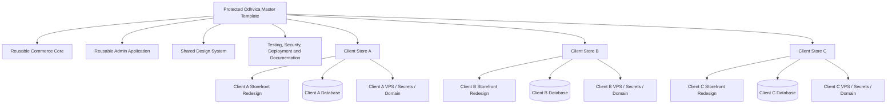
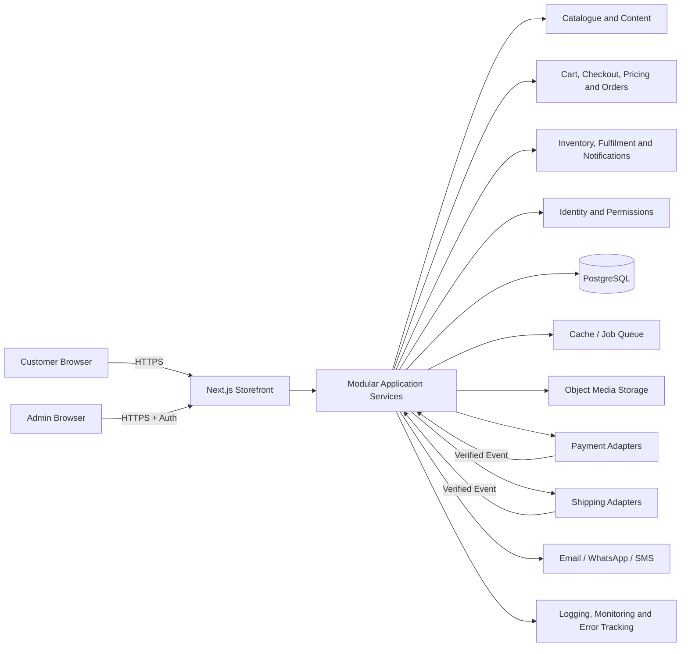
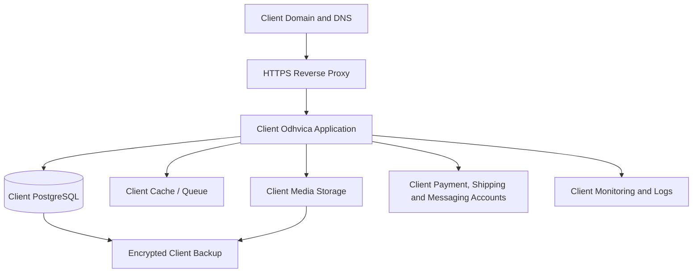
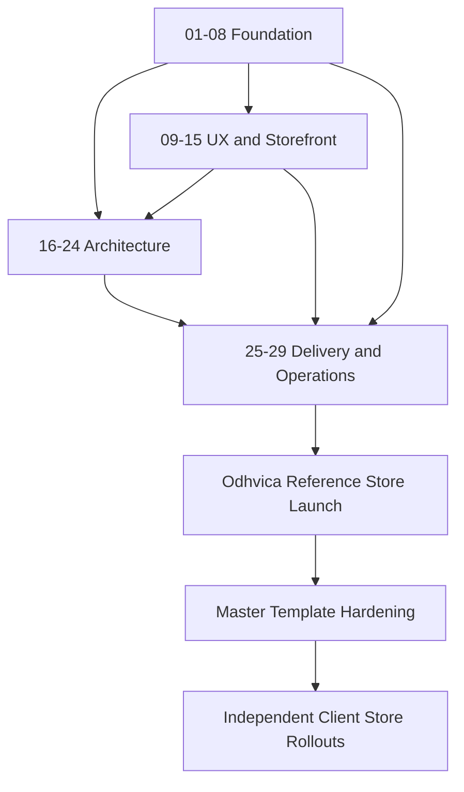

# Odhvica — Executive Summary and Master Blueprint

| Field | Value |
|---|---|
| Document type | Consolidated executive summary and master blueprint |
| Scope | All 29 approved Odhvica project documents |
| Product | Reusable, independently deployed e-commerce template for handmade-fashion brands |
| Reference implementation | Odhvica |
| Version | 1.0 |
| Status | Architecture and delivery blueprint approved; implementation pending final Phase 0 decisions |
| Last updated | 2026-08-12 |

## 1. Executive Summary

Odhvica is a **high-performance, SEO-first, full-stack e-commerce application** designed initially for handmade jackets, kimonos, robes, bags, accessories and related artisan-fashion products. It solves two connected business needs. First, it gives the Odhvica reference brand an independent direct-to-consumer store outside marketplace limitations. Second, it creates a protected reusable source-code template that can be used to launch future client stores without rebuilding the commerce engine from zero.

Odhvica is **not** a multi-vendor marketplace, shared multi-tenant SaaS application or generic website builder. It is a productised e-commerce delivery system. The master template contains reusable commerce, admin, security, deployment, testing and integration foundations. Each future client receives a separately deployed store with its own domain, database, VPS environment, brand, content, products, customer data, payment accounts, shipping configuration, analytics and operational records.

> **Strategic model:** one protected master template; many independent client stores; fully redesigned storefront per client; reusable admin and commerce core across clients.

The platform focuses on the requirements that matter most to handmade commerce: product storytelling, high-quality media, materials and care information, size/fit, unique or limited inventory, made-to-order lead time, personalisation, custom measurements, international selling, trusted checkout and accessible customer support. It is designed around a Next.js-first modular full-stack architecture, PostgreSQL data model, server-authoritative commerce rules, provider adapters for payments/shipping/messaging, and client-isolated deployment compatible with Hostinger VPS.

The 29-document system is the project’s operational backbone. It turns the product from an idea into a buildable, testable, secure, deployable and reusable system. The documents are deliberately grouped into four layers: product foundation, storefront/UX, engineering/architecture, and delivery/operations. Together, they define what to build, how it should behave, how it should be structured, how it should be validated, and how it should later be delivered to clients.

## 2. Business Model and Product Positioning

### 2.1 What Odhvica Is

| Dimension | Odhvica model |
|---|---|
| Reference store | A real independent handmade-fashion business store used to validate the product. |
| Reusable asset | A protected master codebase, documentation set, test suite, deployment process and design system. |
| Client delivery model | Complete e-commerce package: separate deployed store, custom storefront redesign, reusable admin, integrations and support boundary. |
| Target initial niche | Handmade apparel, jackets, kimonos, robes, bags, accessories, personalised gifts and similar artisan products. |
| Revenue potential | Setup/design fee, storefront redesign fee, optional modules, maintenance/support, hosting/operations and client-specific development. |
| Client source-code default | Client receives live deployed website and agreed admin access; master template source code remains protected unless a separate agreement states otherwise. |

### 2.2 What Odhvica Is Not

| Not in the initial model | Reason |
|---|---|
| Etsy-style marketplace with multiple sellers | It conflicts with the separate-client-store model and adds an unnecessary vendor/commission ecosystem. |
| Shared multi-tenant SaaS | It would require tenant isolation, self-service onboarding, shared operations and a different product strategy. |
| Generic drag-and-drop website builder | It would weaken the focused handmade-commerce experience and support model. |
| “Every Shopify app” clone before launch | Feature quantity is not the objective; stable core commerce, performance and reusable delivery are higher priority. |
| Native mobile application in first release | Android/iOS use the same future commerce foundation but follow a stable web/API release. |

## 3. Master Template and Client Store Blueprint

### 3.1 Reuse Boundary

| Layer | Master-template status | Client-store status |
|---|---|---|
| Catalogue, cart, checkout, order, inventory, payment and fulfilment rules | Reusable protected core | Configured and deployed independently |
| Admin UX and core modules | Reusable fixed operations product | Same standard admin design, client data/configuration |
| Storefront UI/brand | Shared primitives/contracts only | Fully redesigned layout, visual identity, campaigns and content |
| Payment/shipping/email/analytics adapters | Reusable integration framework | Client-owned accounts, credentials and enabled providers |
| Database/schema/migrations | Reusable data model/migration path | Separate production database per client |
| Documentation/test/deployment | Reusable operating system | Client-specific scope, configuration, launch and support records |
| Client unique process | Excluded by default | Separate custom module until master-promotion criteria are met |

### 3.2 Client Change Classification

| Incoming request | Correct classification | Where it belongs |
|---|---|---|
| New logo, colors, fonts, hero, navigation look and page layout | Storefront redesign | Client storefront layer |
| Products, policies, prices, collections, shipping rates, domains | Client configuration/data | Client deployment and admin/content system |
| Existing custom-measurement or personalisation capability | Optional reusable module | Configure/enable after scope and test |
| Feature useful across many handmade stores | Candidate master feature | Master review, test, version release |
| One client’s proprietary approval process | Client custom | Isolated client project work |
| Multi-vendor seller onboarding | Out of scope | Requires formal product strategy change |

## 4. Product Scope Blueprint

### 4.1 Core Customer Experience

The customer storefront must enable discovery, confidence and purchase for high-consideration handmade products. The public experience includes a home page, campaign/editorial pages, collections, search, filters, product detail, cart, checkout, account, order tracking, brand/craft story, size/care guides, shipping/returns policies, FAQs and customer support pathways.

| Commerce capability | Odhvica requirement |
|---|---|
| Catalogue | Products, collections, variants, SKUs, product media, pricing, sales, SEO and stock. |
| Handmade product data | Material, craft/process, care, fit, size, variation disclosure, origin, lead time and customisation. |
| Inventory | Ready stock, limited stock, one-of-a-kind items, made-to-order and pre-order-ready foundations. |
| Personalisation | Text, monogram, gift message, measurement, select options and controlled reference-image upload. |
| Cart/checkout | Guest checkout, customer account, promotions, shipping, region/currency, payment method eligibility and safe error recovery. |
| International commerce | Configurable regions, currency presentation, India/international payment routes, shipping zones and policy disclosures. |
| Trust and retention | Reviews, wishlists, consent-aware communication, customer account, order history and support requests. |

### 4.2 Core Admin Experience

The admin panel is a reusable operations interface. It enables clients to run their stores themselves without needing the developer for everyday tasks.

| Admin area | Core responsibilities |
|---|---|
| Dashboard | Sales, orders, inventory, fulfilment, customer-service and integration exceptions. |
| Catalogue | Products, variants, images, inventory, collections, custom fields, SEO and publication. |
| Orders | Payment/order/fulfilment state, custom requirements, production, tracking, returns/refunds/exchanges and timeline. |
| Customers | Customer profile, orders, addresses, consent, support and privacy requests. |
| Marketing/content | Promotions, discounts, reviews, campaigns, homepage, navigation, pages, policies and SEO. |
| Store settings | Shipping, payment status, integrations, currency, staff, permissions and notifications. |
| Reporting | Sales, products, promotions, customers, fulfilment, inventory and operational exceptions. |

## 5. Experience and Design Blueprint

### 5.1 Fixed Admin, Flexible Storefront

The fundamental UX decision is to keep the **admin consistent** and the **storefront flexible**. This makes training, support, testing and operational work reusable, while allowing every client brand to receive a premium and distinct customer-facing identity.

| Design layer | Rule |
|---|---|
| Design tokens | Semantic color, typography, spacing, radius, motion and breakpoint system. |
| Shared UI primitives | Buttons, inputs, dialogs, drawers, alerts, tabs, tables, states and accessibility behaviour. |
| Commerce components | Product card, gallery, variant picker, price, cart line, shipping option, review block and order status. |
| Admin components | Stable operational tables, forms, timelines, status badges, permissions and confirmation patterns. |
| Client theme layer | Brand colors, fonts, imagery, layout, component expression and page composition. |
| Non-negotiables | Accessibility, SEO, performance, cart/checkout rules, price/stock integrity, security and policy visibility. |

### 5.2 Content and Catalogue Model

The content model allows client teams to operate campaigns and everyday content safely. The catalogue model ensures handmade-specific data remains structured instead of being lost in generic product descriptions.

| Content system | Catalogue system |
|---|---|
| Homepage blocks, campaigns, collections, pages, articles, FAQs, policies, navigation and SEO metadata | Product types, variants, media, attributes, customisation fields, inventory mode, pricing, collections, SEO and related products |
| Draft, review, scheduled, published and archived workflow | Draft, review-required, active, sold-out, scheduled and archived product lifecycle |
| Client-owned brand copy/assets/policies | Product snapshot, order snapshot, stock/production state and customer customisation preservation |
| Media rights, alt text, responsive imagery and claim review | Unique stock, made-to-order, custom measurements, personalisation and production lead time |

## 6. Technical Architecture Blueprint

### 6.1 Architecture Overview

### 6.2 Technology Direction

| Layer | Direction | Why it exists |
|---|---|---|
| Application | Next.js-first TypeScript modular monolith | SEO-ready public pages plus full-stack commerce/admin delivery. |
| Runtime | Node.js LTS | Mature deployment compatibility and Next.js support. |
| Database | PostgreSQL per client | Transactional order, payment, inventory and customer data with strong relational integrity. |
| Cache/jobs | Redis-compatible service when justified | Queue, retry, cache, rate limiting and bounded asynchronous work. |
| Media | S3-compatible object storage or controlled VPS media layer | Product images/uploads, responsive delivery, private file controls and backups. |
| Payments | Razorpay, Stripe and PayPal adapters | India and eligible international checkout routes. |
| Delivery | Hostinger-VPS-compatible reverse proxy, container/process deployment, client environment isolation | Independent client operation and controlled release/rollback. |
| Monitoring | Structured logs, health checks, errors, resource/job/provider alerts | Commercial reliability and support readiness. |

### 6.3 Commerce Reliability Model

| Risk | Architectural control |
|---|---|
| Customer changes price/discount in browser | Server recalculates product, variant, promotion, shipping and total. |
| Two customers buy one unique item | Transactional inventory/reservation policy and revalidation at checkout/order confirmation. |
| Browser claims payment success | Verified provider callback/reconciliation controls actual payment/order transition. |
| Provider sends duplicate callback | Provider event ID/idempotency record makes duplicate a safe no-op. |
| Email/provider fails after order | Durable event/job and retry record; customer order remains correct. |
| Product price/content changes after order | Order stores immutable product/price/discount/shipping/customisation snapshot. |
| One client data enters another client store | Separate repository, database, deployment, media, secrets and access boundaries. |

## 7. Security, Privacy and Compliance Blueprint

### 7.1 Security Model

| Security layer | Core control |
|---|---|
| Identity | Secure authentication, session handling, password/reset protection and staff access lifecycle. |
| Permission | Server-side role, permission and object-ownership checks on every protected operation. |
| Payments | No raw payment credential storage; provider verification, idempotency, refund permissions and reconciliation. |
| Secrets | Client/environment-specific server-only storage; no repository/browser/log exposure. |
| Inputs/uploads | Validation, output sanitisation, file type/size/access controls and rate limiting. |
| Infrastructure | HTTPS, firewall, limited network exposure, least-privilege process/users, database/cache isolation. |
| Auditing | Order/payment/inventory/refund/role/integration/configuration events recorded with actor/time/context. |
| Recovery | Encrypted backups, restore drills, incident containment/rotation/recovery runbooks. |

### 7.2 Legal and Compliance Position

Odhvica provides the technical capability for privacy notices, policy pages, consent, data requests, accurate product disclosure, international region controls and commerce records. Each client remains responsible for business facts, policy approval, tax/customs position, consumer obligations, product claims, account eligibility and qualified professional review in their actual selling markets.

> The legal/compliance document is a working technical/business checklist, not formal legal advice. Client policies and regional obligations require qualified review before launch.

## 8. Operating and Deployment Blueprint

### 8.1 Client-Isolated Deployment

### 8.2 Release Discipline

| Release phase | Required evidence |
|---|---|
| Plan | Approved scope, risk classification, acceptance criteria, client/master classification and migration/integration impact. |
| Build | Type/build/lint/test/security checks and versioned artifact. |
| Stage | Functional/provider sandbox/accessibility/performance/security validation. |
| Prepare | Backup, configuration/secrets verification, rollback plan, release note and owner approval. |
| Deploy | Controlled artifact deployment and approved database migration. |
| Smoke test | Public product/cart, admin login, order/payment/provider health, jobs/notifications and monitoring. |
| Observe | Error/resource/provider/queue monitoring through a defined observation period. |
| Close | Release record, client communication, known issue and update/rollback status. |

## 9. The 29-Document Operating System

### 9.1 Document Groups

| Group | Documents | Purpose |
|---|---|---|
| Foundation | 01–08 | Product strategy, scope, commercial rules, reuse model, decisions and contributor behaviour. |
| Storefront and UX | 09–15 | Customer/admin UX, design system, content, catalogue, SEO/analytics and accessibility. |
| Engineering and Architecture | 16–24 | Architecture, system flow, data, APIs, integrations, security, performance, code structure and reference implementation. |
| Delivery and Operations | 25–29 | Code quality, testing, VPS operations, compliance checklist and phased implementation plan. |

### 9.2 Complete Document Index

| # | File | Core contribution | Depends primarily on |
|---:|---|---|---|
| 01 | `project_summary.md` | Product vision, target niche and baseline decisions | Business objective |
| 02 | `project_instruction.md` | Standing rules, master/client separation and build guardrails | 01 |
| 03 | `prd.md` | Functional requirements and release priorities | 01–02 |
| 04 | `feature_scope.md` | Core/advanced/optional/future/client-custom governance | 03 |
| 05 | `commerce_rules.md` | Pricing, orders, payments, shipping and return rules | 03–04 |
| 06 | `reuse_model.md` | Master template/client project lifecycle and version policy | 02, 04–05 |
| 07 | `memory.md` | Decision log and change history | 01–06 |
| 08 | `agent.md` | Contributor workflow and project working rules | 01–07 |
| 09 | `storefront_ux.md` | Customer journeys, sitemap, page and responsive requirements | 03–05 |
| 10 | `admin_ux.md` | Reusable store operations/admin experience | 03–05 |
| 11 | `design_system.md` | Tokens, components, fixed admin and flexible storefront rules | 09–10 |
| 12 | `content_model.md` | Pages, campaigns, media, policies and publishing governance | 09, 11 |
| 13 | `catalog_model.md` | Product/variant/inventory/customisation/merchandising model | 03–05, 09–12 |
| 14 | `seo_analytics.md` | Search discoverability, event model, tracking and reporting | 09, 12–13 |
| 15 | `accessibility.md` | Inclusive storefront/admin/component/content requirements | 09–14 |
| 16 | `architecture_design.md` | High-level application, VPS and client-isolation architecture | 01–15 |
| 17 | `system_design.md` | Checkout/order/payment/inventory/job/cache state behaviour | 05, 13, 16 |
| 18 | `db_schema.md` | Relational data model, snapshots, states, audit and migration rules | 13, 16–17 |
| 19 | `api_contracts.md` | Service/API boundaries, errors, auth and idempotency contracts | 16–18 |
| 20 | `integration_spec.md` | Payments, shipping, messaging, media and analytics adapters | 05, 16–19 |
| 21 | `security_blueprint.md` | Authentication, access, payment, upload, secrets and incident controls | 16–20 |
| 22 | `performance_plan.md` | Rendering, media, cache, VPS capacity and performance quality | 09, 11, 14, 16–21 |
| 23 | `folder_structure.md` | Repository/module/UI/server/client-theme structure | 11, 16–22 |
| 24 | `reference_implementation.md` | Odhvica first-store configuration and proof scenarios | 01–23 |
| 25 | `code_quality.md` | Engineering standards, reviews and definition of done | 16–24 |
| 26 | `testing_quality.md` | Test strategy, release gates, defects and acceptance | 16–25 |
| 27 | `devops_deployment.md` | VPS deployment, backups, monitoring, rollout and rollback | 16, 20–22, 25–26 |
| 28 | `legal_compliance.md` | Client policy/privacy/commerce/compliance launch checklist | 05, 12, 14, 20–21, 26–27 |
| 29 | `implementation_plan.md` | Build phases, delivery gates, master hardening and client rollout | 01–28 |

### 9.3 Document Dependency Map

## 10. Implementation Sequence and Phase Gates

### Phase 0 — Final Decisions

Finalise actual selected tools and accounts before production implementation: ORM/data access, authentication, queue/cache, media storage, monitoring, Hostinger VPS operating setup, payment-provider eligibility/webhook flow, courier choices, messaging sender, policy ownership and Odhvica brand/catalogue assets.

**Gate:** every unresolved item in architecture, integrations, deployment and compliance has a documented owner, decision and impact.

### Phase 1 — Platform Foundation

Build the application skeleton, client-isolated environment model, PostgreSQL/migrations, authentication/roles, design primitives, logging/health, CI/release foundation and test harness.

**Gate:** a protected non-production Odhvica build can deploy, authenticate authorised roles, migrate data, log errors and run baseline quality checks.

### Phase 2 — Catalogue and Storefront

Implement catalogue, products, variants, media, collections, content, public pages, search, product detail, custom fields, design system, accessibility and SEO baseline.

**Gate:** an admin can publish a valid handmade product and a customer can find, understand and select it on mobile/desktop.

### Phase 3 — Commerce Engine

Implement cart, pricing, promotions, shipping eligibility, checkout, payment adapters, verified callbacks, inventory integrity, orders, production/fulfilment, tracking and notifications.

**Gate:** representative India/international test orders and failure/duplicate/refund paths produce correct secure states.

### Phase 4 — Admin Operations

Implement/complete reusable product, order, customer, content, promotion, settings, reporting, staff permissions and audit workflows.

**Gate:** a non-technical owner can operate the store without developer assistance for routine tasks.

### Phase 5 — Advanced Modules and Growth

Enable validated courier automation, reviews/wishlist, return/exchange flow, consent-aware marketing, analytics, advanced merchandising and reporting only after core quality is stable.

**Gate:** each module has a clear business case, provider/configuration, security/performance/consent plan and test evidence.

### Phase 6 — Odhvica Reference Launch

Configure real Odhvica products, policies, accounts, domain, payments, shipping, content, access, backups, monitoring and support process. Complete acceptance and launch checks.

**Gate:** reference-store scenarios, security, performance, accessibility, provider, backup/restore and client-owner business approvals pass.

### Phase 7 — Master Template Hardening

Remove Odhvica-specific content, assets, secrets and business configuration from shared paths. Tag the master version, document client setup, run master fixtures/tests and prove a clean clone.

**Gate:** a non-production client store can be created from master without Odhvica data/secrets/branding dependency.

### Phase 8 — Client Store Delivery

For every future client: discovery, classification, master version selection, isolated provision, complete storefront redesign, configuration/import, integration setup, test/acceptance, launch and support.

**Gate:** client launches only after client business/policy approval plus technical, security, accessibility, performance, payment, shipping, domain and rollback checks.

## 11. Critical Release Gates

| Gate | Must be true before launch/major release |
|---|---|
| Product | Scope and acceptance criteria are approved; feature is correctly classified. |
| Customer experience | Responsive mobile/desktop purchase path is complete, accessible and policy/price/stock clear. |
| Commerce | Server-side price/stock/promotion/checkout/order rules pass normal and failure scenarios. |
| Payment | Eligible provider route, secure verified callback, duplicate prevention, refund/reconciliation and fallback are tested. |
| Security | Authentication, permissions, ownership, secrets, uploads, provider verification and logging are reviewed. |
| Data | Migration, snapshot, inventory, audit and backup/restore behaviour are validated. |
| Performance | Critical pages/media/scripts/queries meet approved measured budget. |
| Operations | Deployment, health, monitoring, alerts, rollback and incident contact/runbook are ready. |
| Compliance | Client-approved content/policies/consent/region/payment/shipping/tax/customs responsibility is recorded. |
| Client acceptance | Client owner has tested/admin-trained/signed off on business-critical workflows. |

## 12. First Implementation Priorities

The first development cycle should not start with every advanced feature. It should start with the smallest **complete vertical commerce slice**:

1. Odhvica store configuration, authentication/roles and secure environment foundation.
2. Product catalogue with a size-variant handmade jacket and a product media/story page.
3. Collection/home discovery, responsive storefront, search/filter basics and policy pages.
4. Cart with server-side price/availability/customisation validation.
5. Checkout with one validated test payment path, order snapshot, inventory update and confirmation email.
6. Admin product/order dashboard and manual fulfilment/tracking.
7. Quality/security/performance/accessibility/deployment checks.

After this path is stable, add the remaining payment routes, made-to-order workflow, custom measurements, promotions, returns/refunds/exchanges, courier automation, reviews/wishlist, marketing automation and advanced reporting in controlled releases.

## 13. Key Decisions Still Required Before Coding

| Decision | Why it matters |
|---|---|
| Final data access/ORM approach | Determines migration, repository and type-safety implementation. |
| Authentication/session approach | Determines customer/admin security, roles, future mobile support and session management. |
| Media storage choice | Determines cost, image optimisation, upload privacy, backup and VPS disk strategy. |
| Cache/job service choice | Determines retry, notification, provider reconciliation, rate limits and scale behaviour. |
| Payment provider account eligibility | Determines exact enabled regions, currencies, provider callbacks and refund operations. |
| Shipping/courier operational scope | Determines manual versus automated rates/labels/tracking workflow. |
| Email/WhatsApp provider | Determines notifications, consent templates, sender verification and support reliability. |
| Monitoring/error tooling | Determines support visibility, incident response and client privacy/data sharing. |
| Odhvica visual direction/assets | Determines first storefront implementation and design-token values. |
| Initial product catalogue/data | Determines sample variants, media, custom fields, stock modes and test fixtures. |
| Client policy/business inputs | Determines published terms/privacy/shipping/returns/custom-product content and region rules. |

## 14. Final Blueprint Statement

Odhvica is now fully specified as a **reusable, secure, high-performance e-commerce product system**, not simply a single website. Its operating model is deliberately disciplined: build Odhvica as the real reference store; prove the core handmade-commerce flow; harden only reusable features into the protected master; and deploy separate, uniquely designed client storefronts on the same tested commerce/admin foundation.

The project should be judged by five outcomes:

| Outcome | Definition |
|---|---|
| Commercial independence | Odhvica and future clients own their storefront, domain, customer relationship, catalogue and marketing setup. |
| Handmade-commerce quality | Product story, customisation, inventory, production and international delivery realities are handled accurately. |
| Reusable delivery speed | Client stores launch from a mature master instead of starting from zero. |
| Operational confidence | Store owners can manage daily business through a consistent admin panel with secure integrations and support processes. |
| Sustainable engineering | Each new feature, redesign, release and client deployment preserves quality, security, performance and maintainability. |

## Related Documents

This master blueprint summarises Documents `01_project_summary.md` through `29_implementation_plan.md`. The individual documents remain the authoritative detailed specifications for their respective areas.
