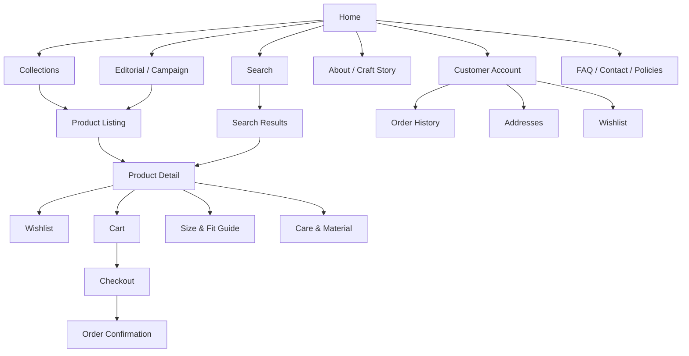

# Odhvica — Storefront UX Blueprint

| Field | Value |
|---|---|
| Document ID | 09 |
| Status | Approved UX foundation |
| Version | 0.1 |
| Applies to | Odhvica reference store and future client storefront redesigns |
| Owner | Product owner / UX lead |
| Last updated | 2026-08-12 |

## 1. Purpose

This document defines the customer-facing information architecture, core page requirements, interaction rules, responsive behaviour, and journey principles for Odhvica. It is intended to support premium handmade-fashion selling: customers must be able to discover products, understand craftsmanship and fit, choose the correct variant or customisation, trust the store, and complete an international purchase with minimal ambiguity.

The document defines a reusable commerce experience, not a fixed visual template. Every client can receive a completely new storefront design as long as the required commerce information, accessibility, SEO, mobile behaviour, and validated cart/checkout contracts are preserved.

## 2. Experience Objectives

| Objective | UX outcome |
|---|---|
| Product discovery | Customers can move from campaigns, navigation, search or shared links to the correct collection and product without confusion. |
| Handmade confidence | Customers can understand what makes a product unique, how it fits, how it is made, how long it takes, and what to expect. |
| Premium merchandising | Editorial content, collection imagery and product photography create a high-quality brand experience without obscuring purchase actions. |
| Conversion clarity | Price, sale status, size, variants, personalisation, stock, delivery, policy and checkout total are visible at the decision point. |
| International readiness | Country/currency context, shipping eligibility, delivery expectations and available payment routes are clear before payment. |
| Mobile usability | Product selection, search, filters, gallery, cart and checkout remain efficient on small touch screens. |
| Reusable delivery | The page system and commerce contracts are reusable across client storefront redesigns. |

## 3. Storefront Experience Principles

### 3.1 Story-led, but purchase-capable

Handmade products are bought with both emotion and practical confidence. The storefront must convey craftsmanship, textile story, artisan value, styling and visual character, while keeping size, availability, delivery and return information accessible at the moment the customer needs it.

### 3.2 Respect the customer’s decision process

The application must not hide key purchase conditions behind unnecessary interaction. A customer should not have to search for the price, selected variant, fit guidance, production lead time, shipping eligibility, or policy context.

### 3.3 Fast visual richness

Fashion and artisan stores require rich imagery, but the experience must use responsive media, prioritised loading, sensible gallery behaviour and restrained third-party scripts. The visual layer must not trade away discoverability, accessibility or performance.

### 3.4 Consistent commerce, flexible aesthetics

A client may redesign the header, product-card style, layout density, editorial blocks, campaign hero, typography, visual hierarchy and navigation presentation. The redesign must still preserve the required semantics and customer outcomes in this document.

## 4. Primary Customer Journeys

| Journey | Customer objective | Required outcome |
|---|---|---|
| Campaign discovery | Explore a launch, sale, wedding edit, seasonal edit or craft story | Customer reaches a curated collection or product set with relevant narrative and filters. |
| Category browse | Browse jackets, kimonos, bags, accessories or other product groups | Customer can narrow products using appropriate filters/sorting and open a product detail page. |
| Search-led discovery | Find a known product, colour, material, garment type or style | Search results show relevant products and explain no-results states. |
| Product evaluation | Understand a product, compare variants and decide suitability | Customer has product media, price, size/fit, material, care, lead time, stock and delivery information. |
| Custom-order purchase | Provide measurement/personalisation details for a handmade item | Required fields validate before cart; confirmed order preserves customer input. |
| Guest purchase | Complete a fast checkout without account friction | Customer adds product, enters delivery/payment information and receives confirmation. |
| Returning customer | Reorder, view order status, manage address or wishlist | Customer account provides clear self-service access. |
| Post-purchase support | Request help for cancellation, return, exchange or delivery enquiry | Customer sees the correct policy and approved support/request route. |

## 5. Information Architecture

The exact visual navigation may change by client, but the content map below defines the minimum reusable storefront architecture.

## 6. Page Inventory

| Page / surface | Required purpose | Reusable commerce requirement |
|---|---|---|
| Home | Brand introduction, featured collections, campaigns, stories and product discovery | Configurable content blocks, linkable campaigns and fast responsive media. |
| Navigation | Global access to collections, search, account and cart | Desktop/mobile equivalence, accessible menu behaviour, category hierarchy. |
| Search | Product discovery by terms and attributes | Query input, relevant results, filtering, no-result recovery and analytics event. |
| Collection / category | Browse an edited product group | Collection story, product grid, filters, sort, pagination/load-more strategy and SEO content. |
| Product listing | Show comparable products | Product image, title, price, sale state, availability and configurable quick actions. |
| Product detail | Explain and sell one product | Product selection, customisation, media, details, trust, cart action and related products. |
| Cart | Review intended purchase | Line-item visibility, quantity, customisation snapshot, promotions, shipping preview and checkout entry. |
| Checkout | Confirm purchase | Customer data, address, shipping, payment eligibility, final total and clear errors. |
| Confirmation | Close the transaction | Order reference, next steps, fulfilment expectation, account/support path and analytics completion. |
| Account | Enable repeat purchase and support | Profile, addresses, orders, wishlist, consent preferences and request paths. |
| Editorial / campaign | Support brand storytelling and merchandising | Modular content, product links, SEO controls and responsive assets. |
| Informational pages | Build trust and policy clarity | About, artisan story, material/care, size guide, FAQs, shipping, returns, privacy and terms. |

## 7. Home Page Requirements

The home page is an editorial conversion page, not merely a product grid. Its content blocks must be configurable so future clients can create distinct storefronts without modifying underlying commerce logic.

| Block | Required behaviour |
|---|---|
| Announcement / utility bar | Displays configured delivery, promotion, launch or service message; must be dismissible/configurable where appropriate. |
| Header | Gives access to brand navigation, search, account and cart; must work on mobile and keyboard navigation. |
| Hero / campaign | Displays high-priority campaign story with primary CTA, optional secondary CTA and responsive media. |
| Collection feature | Links to a configured collection or category with visual and textual context. |
| Product feature | Displays selected products, new arrivals, bestsellers or sale items without hard-coding data. |
| Craft/brand story | Supports artisan, material, sustainability, origin or process storytelling. |
| Editorial / styling | Supports lookbook, occasion, gift, seasonal or styling content. |
| Social proof | Supports reviews, press, creator content or trust indicators only when data/use rights are valid. |
| Newsletter / consent capture | Uses clear value statement and consent-aware capture. |
| Footer | Provides policies, contact, social links, regional/store information and accessibility-friendly navigation. |

Home-page block order, layout, visual treatment and block selection are client-storefront decisions. The underlying content model and publishing rules are defined in `12_content_model.md`.

## 8. Collection and Product Listing Requirements

Collection pages must balance editorial storytelling and efficient product comparison. They should support the broad category structures common in handmade fashion, including product type, material, style, occasion, colour, size, price, availability and sale status where configured.

| Area | Required UX rule |
|---|---|
| Collection title and copy | Explain the collection without hiding product access or creating excessive visual height on mobile. |
| Product grid | Responsive layout with consistent image ratio rules and a predictable card hierarchy. |
| Filters | Show only attributes available for that collection; apply accessibly and communicate selected states. |
| Sort | Support configured relevance/featured, newest, price and availability options. |
| Sale state | Clearly distinguish sale price and reference/original price when used. |
| Product card | Show image, title, price, sale state and product availability indicators; interaction must not interfere with opening product detail. |
| Load strategy | Use the chosen pagination/load-more/infinite-scroll behaviour consistently and retain filter/search context. |
| Empty state | Explain no matching products and provide reset/browse recovery action. |
| Mobile filters | Use a focused, dismissible filter interface with applied-filter count and clear/reset controls. |

## 9. Product Detail Requirements

The product detail page is the highest-priority decision surface for the handmade category. All content must be prioritised so customers can add a product confidently without excessive scrolling or hidden conditions.

| Product-detail area | Required information / behaviour |
|---|---|
| Product identity | Title, collection/category context, product type and relevant sale/badge state. |
| Gallery | Multiple images, alt text, zoom/lightbox only if accessible, media order and responsive loading strategy. |
| Price | Current price, valid sale/reference price, currency context and any variant-level price adjustment. |
| Variant selection | Clear choices for size, colour, material, length or other configured variations; unavailable values are distinguishable. |
| Handmade input | Required custom measurements, personalisation, notes, gift message or file upload when product configuration requires them. |
| Availability | Ready-stock, low stock, sold-out, one-of-a-kind or made-to-order status. |
| Delivery expectation | Production lead time plus shipping/delivery estimate where configured. |
| Primary action | Add to cart action remains visible/reachable after selection; disabled state explains missing/invalid input. |
| Fit and care | Size guide, fit information, material, care, origin and variation disclosure. |
| Trust/policy | Shipping, returns, payments, customer support, reviews and relevant guarantees/assurances. |
| Related discovery | Configured related products, complete-the-look or collection continuation without distracting from primary action. |

A mobile product page may use a sticky add-to-cart region after the customer has seen the key purchase controls, but it must reflect selected variant, price and unavailable/validation state correctly.

## 10. Cart and Checkout UX Rules

Cart and checkout must minimise uncertainty. Product customisation, selected variants, prices, promotion outcome, shipping method, delivery address and total must remain intelligible through the transition from storefront to payment provider.

| Stage | UX requirement |
|---|---|
| Cart review | Show product image, title, selected variant, custom fields summary, price, quantity, removal action and availability messages. |
| Promotion | Show promotion entry and result clearly; rejected codes explain why without removing valid cart contents. |
| Shipping preview | Show when an estimate is provisional versus confirmed by checkout address/method. |
| Checkout identity | Offer guest checkout; avoid forced account creation before purchase. |
| Address | Validate field errors close to the relevant field and preserve valid input. |
| Delivery | Present only eligible shipping methods with transparent cost/estimate. |
| Payment | Present only eligible configured payment methods and prepare customers for external provider hand-off where applicable. |
| Final confirmation | Repeat key totals and place terms/policy acknowledgement according to the final compliance design. |
| Error recovery | Payment failures, address errors, stock changes and provider interruption states must be specific and allow safe retry. |

## 11. Account and Post-Purchase UX

Customer accounts must add real value rather than become a barrier to purchase. A customer must be able to find previous orders, current fulfilment context, saved addresses, communication preferences and enabled wishlist/review/support functions.

Confirmation and order-status views must clearly distinguish order confirmation, payment condition, made-to-order production, shipment and delivery. Do not show a generic “success” message when payment or order confirmation is pending.

## 12. Responsive Behaviour Rules

| Area | Mobile requirement | Desktop requirement |
|---|---|---|
| Header/navigation | Compact navigation, accessible menu drawer, search/cart/account access and clear close/focus behaviour. | Visible hierarchy with efficient category access and non-obstructive utility links. |
| Product grid | Optimised grid density; no unreadable cards or accidental taps. | Grid density may increase while retaining image and price readability. |
| Filters | Modal/drawer pattern with apply/reset and active count. | Sidebar, inline or drawer pattern allowed if states remain visible. |
| Product gallery | Swipe/tap accessible; image loading optimised; zoom must not trap interaction. | Larger gallery/zoom layouts allowed with keyboard support. |
| Purchase controls | Variant/custom input and cart action must remain easy to reach; sticky action only if accurate. | May use side-by-side gallery/detail layout with visible primary CTA. |
| Checkout | One primary flow; concise sections and clear field errors. | May use order summary beside form without reducing readability. |

The design system will define responsive breakpoints and component rules. Exact visual layout must not be copied from the reference stores; it will be client-specific.

## 13. Content and System States

Every customer-facing surface must define more than the ideal populated state.

| State | Required response |
|---|---|
| Loading | Avoid layout shift; use meaningful placeholders and preserve page orientation. |
| No content | Explain why the page/collection/search has no result and offer recovery action. |
| Sold out | Prevent invalid cart addition and offer configured alternative, wishlist or back-in-stock path where enabled. |
| Variant unavailable | Keep selection clear; do not silently swap an unavailable choice. |
| Custom input invalid | Identify the relevant input, explain validation rule and preserve entered data. |
| Network/system error | Provide concise retry/support path without exposing internal details. |
| Payment error | Preserve cart/order context safely and explain next available customer action. |
| Region restricted | Explain unavailability without suggesting a checkout path that cannot succeed. |

## 14. Accessibility and Trust Requirements

Storefront redesign must comply with the rules later formalised in `15_accessibility.md`. At a minimum, navigation, search, filters, product galleries, selection controls, cart, checkout and account flows must remain keyboard usable, screen-reader interpretable, contrast-aware, touch-friendly and understandable without relying only on colour or imagery.

Trust content should be precise and verifiable. Avoid vague claims or misleading scarcity. For handmade products, display accurate product condition, availability, production timing, variation disclosure, delivery expectation and policy context.

## 15. Analytics Events

The storefront must support a governed event model. Core event categories include collection view, search, filter use, product view, variant selection, customisation completion, add to cart, cart view, checkout start, shipping selection, payment attempt, purchase confirmation, wishlist action, review action and support/return request. The final event definitions, consent behaviour and tools will be specified in `14_seo_analytics.md`.

## 16. UX Acceptance Checklist

A storefront release is acceptable when a customer can discover, assess and purchase a handmade product on mobile and desktop; understand variant/customisation and delivery conditions; recover from common errors; access relevant policies; and complete the journey with accessible, performant and coherent interaction.

## Related Documents

`03_prd.md` defines required functionality. `05_commerce_rules.md` defines commercial behaviour. `10_admin_ux.md` defines the internal operations experience. `11_design_system.md` defines reusable components and tokens. `12_content_model.md`, `13_catalog_model.md`, `14_seo_analytics.md` and `15_accessibility.md` provide supporting rules.
