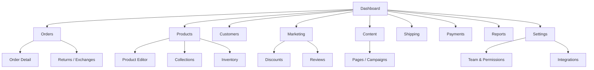
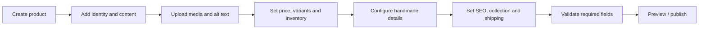
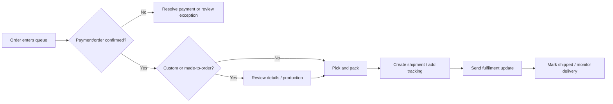
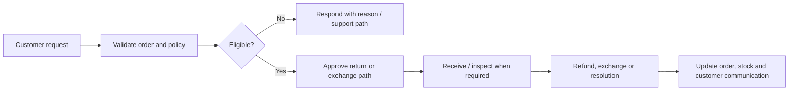

# Odhvica — Admin UX Blueprint

| Field | Value |
|---|---|
| Document ID | 10 |
| Status | Approved UX foundation |
| Version | 0.1 |
| Applies to | Odhvica and all independently deployed client-store admin panels |
| Owner | Product owner / UX lead |
| Last updated | 2026-08-12 |

## 1. Purpose

This document defines the reusable operations experience for Odhvica administrators and staff. Unlike the storefront, the admin panel is intentionally consistent across client stores. It should make daily business work understandable for store owners without requiring technical knowledge or repeated developer support.

The admin UX must support the operational reality of handmade-fashion commerce: image-heavy catalogue management, variants, limited/unique stock, made-to-order product details, custom customer inputs, production/fulfilment stages, international shipping, payments, promotions, customer service, content and reporting.

## 2. Admin Experience Principles

| Principle | Admin UX implication |
|---|---|
| Operational clarity | Status, exceptions, next action and business consequence must be visible without searching across unrelated screens. |
| Safe defaults | Destructive or irreversible actions require contextual warning, permission and confirmation. |
| Consistent patterns | Tables, filters, forms, status badges, timelines, bulk actions, drawers and confirmation patterns remain the same across modules. |
| Role-aware access | Staff see only the functions and data needed for their role. |
| Auditability | Sensitive and material changes are traceable through records, timestamps and responsible user identity. |
| Mobile-aware, desktop-first | Daily operational work is optimised for desktop/tablet, while critical checks and narrow tasks remain usable on mobile. |
| Client independence | Every client admin operates only on its own separately deployed store data and configuration. |

## 3. Admin Roles

The precise permission matrix will be defined in later security documentation, but the UX must support at least the following role model.

| Role | Primary responsibility | Typical access |
|---|---|---|
| Owner | Business control, configuration and commercial decisions | Full access subject to high-risk confirmation rules. |
| Store manager | Day-to-day operations | Products, orders, customers, promotions, content, reporting and selected settings. |
| Catalogue/content staff | Products, media, collections, pages and SEO | No payment, user, secret or high-risk financial access. |
| Fulfilment staff | Production, packing, dispatch and tracking | Orders, fulfilment fields, order notes, limited customer/shipping data. |
| Customer support staff | Enquiries, order support and requests | Customers, orders, approved request actions; restricted financial/settings access. |
| Finance staff | Payment visibility, refunds and reconciliation | Payment/refund reports and controlled financial actions. |
| Developer/support operator | Technical maintenance | Time-bound, least-privilege access only when authorised. |

## 4. Admin Information Architecture

The exact navigation labels can be refined, but the underlying module hierarchy is stable across all client stores.

| Main navigation item | Primary job |
|---|---|
| Dashboard | Identify sales, orders, stock and operational exceptions requiring action. |
| Orders | Review, fulfil, communicate, refund and resolve customer orders. |
| Products | Create and maintain products, variants, media, collections and inventory. |
| Customers | Understand customer relationship, orders, addresses, consent and support context. |
| Marketing | Manage discounts, promotions, reviews, email/marketing configuration and campaign performance. |
| Content | Manage storefront pages, homepage blocks, policies, FAQs, navigation and SEO content. |
| Shipping | Configure shipping zones/methods and manage tracking/fulfilment providers. |
| Payments | View payment states, refunds, provider configuration state and reconciliation exceptions. |
| Reports | Review sales, products, customers, promotions, fulfilment and inventory performance. |
| Settings | Manage store identity, regional rules, staff roles, integrations, notifications and security-sensitive configuration. |

## 5. Global Admin Layout

| Layout element | Requirement |
|---|---|
| Persistent navigation | Clear active state, collapsible only when it remains discoverable, and role-aware visibility. |
| Global search / command access | Search products, orders, customers and relevant settings quickly with permission enforcement. |
| Store context | Clearly display the active store/brand environment; avoid ambiguity between staging and production. |
| Notifications | Surface actionable exceptions such as payment issue, low stock, unfulfilled order or failed integration without replacing the underlying task list. |
| Page title and action area | Every page names the job, current scope/filters and primary permitted action. |
| Saved filters/views | Support frequent operational views such as “new paid orders,” “made-to-order review,” “low stock,” or “refund requests.” |
| Status language | Use human-readable status labels with text and visual treatment; do not rely solely on colour. |
| Confirmation patterns | Use confirmation/modals for irreversible actions; describe impact and reversal conditions. |

## 6. Dashboard Requirements

The dashboard is an operations cockpit, not a decorative analytics page. It must allow the owner or manager to identify work and drill into the relevant module.

| Dashboard surface | Requirement |
|---|---|
| Sales overview | Configured timeframe summary with links to underlying orders/reports. |
| Order queue | New, pending, review-required, paid, in-production, ready-to-ship and delayed orders as applicable. |
| Fulfilment exceptions | Orders needing action because of stock, payment, address, customisation, shipment or provider issue. |
| Inventory alerts | Low-stock, out-of-stock and one-of-a-kind availability alerts. |
| Customer/service tasks | Return, exchange, cancellation, support or review-moderation requests where enabled. |
| Performance summary | Top products, collection/promotion performance and customer indicators as configured. |
| System notices | Backup/deployment/integration warnings only for authorised technical/owner roles. |

## 7. Product and Catalogue UX

### 7.1 Product List

The product list must support frequent catalogue work at scale. It requires search, filters, saved views, bulk actions, inventory visibility, product status and fast drill-down to a product editor.

| Product-list capability | Required behaviour |
|---|---|
| Search | Search by title, SKU, product ID, collection, tag and relevant attributes. |
| Filters | Product status, availability, collection, type, inventory state, made-to-order state, sale status and date updated. |
| Bulk actions | Publish/unpublish, archive, collection/tag assignment, selected inventory/status updates and export where approved. |
| Row information | Image thumbnail, title, product status, price context, stock/made-to-order state, collection and update time. |
| Safety | Destructive action requires confirmation and affects only authorised records. |

### 7.2 Product Editor

The product editor must be structured around a business user’s mental model, not raw database fields. Long forms should use grouped sections, clear completion states, validation and safe drafts.

| Product-editor section | Required content |
|---|---|
| Identity | Product title, slug/URL, product type, status and collection/category placement. |
| Media | Ordered image/video/media management, alt text, crop/display guidance and file status. |
| Pricing | Base price, sale/reference price, cost/margin fields where enabled, currency and scheduled sale behaviour. |
| Variants | Option names, values, SKU, price adjustment, availability, inventory and imagery association. |
| Handmade details | Material, care, origin, artisan/story, production time, product variation disclosure and customisation configuration. |
| Inventory | Stock mode, quantity, low-stock threshold, one-of-a-kind control and manual adjustment log. |
| Content/SEO | Description, fit/size, metadata, structured content and related-product settings. |
| Shipping | Product weight/dimensions/shipping eligibility where required. |
| Publish review | Validation summary, missing required information, preview/QA link and publish state. |

## 8. Order Management UX

Orders are the most operationally sensitive module. The interface must make payment, production and fulfilment state distinct and actionable.

| Order-list capability | Requirement |
|---|---|
| Filters and views | Filter by order, payment, fulfilment, date, country, customer, shipping method, product, custom/made-to-order state and exceptions. |
| Order status | Display order, payment, fulfilment and post-purchase-request status separately. |
| Bulk operation | Allow only safe, permissioned bulk actions such as mark ready, assign queue, export or print packing list. |
| Alerts | Surface fraud/payment uncertainty, customisation issue, address issue, stock issue, overdue production and carrier exception. |
| Search | Find by order number, customer, email, phone where authorised, tracking number or product/SKU. |

### 8.1 Order Detail

The order-detail page is the canonical operational record. It must show a timeline and avoid hiding critical customisation or payment information.

| Order-detail section | Required content |
|---|---|
| Summary | Order number, creation date, total, currency, order/payment/fulfilment status and priority/exception indicators. |
| Items | Product snapshot, selected variants, quantity, price snapshot, discounts, custom inputs, uploaded references and fulfilment allocation. |
| Customer | Contact, shipping/billing address, account context, order history link and communication preference indication. |
| Payment | Provider, payment state, transaction reference, refund state and reconciliation information permitted to role. |
| Fulfilment | Production state, packing state, shipping method, tracking, shipment events and internal operational notes. |
| Timeline | Auditable history of significant order, payment, fulfilment, communication, support and refund actions. |
| Actions | Context-sensitive permitted actions with confirmation and appropriate customer communication. |

## 9. Customer Management UX

The customer record must enable service and repeat-commerce work without exposing data unnecessarily.

| Customer surface | Required content |
|---|---|
| Customer list | Search/filter by purchase history, country, consent, date, order status and customer state subject to permissions. |
| Customer profile | Identity/contact data, addresses, orders, request history, notes, review/wishlist context where enabled and communication preferences. |
| Privacy actions | Controlled access to export, correction, deletion/anonymisation requests and consent updates according to final compliance rules. |
| Support actions | Link to support/cancellation/return/exchange context without allowing unauthorised financial actions. |

## 10. Content and Marketing UX

The admin must allow a store owner to maintain a living storefront without code changes for routine content work. It should provide clear distinction between published content, scheduled content, draft content and client-specific visual design work that requires developer/design support.

| Module | Required UX behaviour |
|---|---|
| Pages/campaigns | Create, edit, preview, schedule, publish/unpublish and manage metadata with safe version/draft awareness. |
| Navigation | Manage menu links and collection/page relationships with validation against broken destinations. |
| Homepage blocks | Configure allowed blocks/content data; do not expose unsafe arbitrary layout controls by default. |
| Discounts | Create/edit conditions, schedule, test eligibility and view usage. |
| Reviews | Moderate, publish/hide, reply and link review state to product/customer policy. |
| Email/marketing | Configure approved integrations/templates and view consent-aware audience controls; execution rights are role-limited. |

## 11. Shipping, Payment and Settings UX

Settings are high-impact. They must be separated from routine content/product tasks and protected by permissions, warnings, validation and change history.

| Settings area | UX rule |
|---|---|
| Shipping zones/methods | Explain country/region eligibility, rates, free-shipping conditions and impact before publication. |
| Payment configuration | Show connection state, supported routes, required action and test/production context without exposing secrets. |
| Currency/regional rules | Show store base settings, display options and sales-region impact clearly. |
| Tax/invoice settings | Provide configuration guidance and validation, not unverified legal conclusions. |
| Notifications | Define recipient, trigger, template and enabled state; show test capability where safe. |
| Team access | Show role, permissions, invitation/access state and revocation controls. |
| Integrations | Show provider, connection health, permissions, last activity/error and reconnect/support path. |

## 12. Key Admin Flows

### 12.1 New Product Flow

### 12.2 Order Fulfilment Flow

### 12.3 Return/Refund Request Flow

## 13. Responsive and Accessibility Rules

The admin is primarily desktop-first, but not desktop-only. On narrow screens, key dashboards, order review, product status, fulfilment actions and notifications must remain usable. Complex tables may use responsive summaries, detail drawers or stacked layouts; they must not simply become horizontally unusable.

All interactive controls need visible labels, keyboard operation, focus management, text status in addition to colour, error messaging close to the action, logical reading order and adequate touch target size. See `15_accessibility.md` for formal requirements.

## 14. Admin UX Acceptance Criteria

The admin UX is acceptable when an authorised store owner can create a sellable handmade product, maintain collections/content, review a purchase, see custom product data, fulfil an order, add tracking, manage a customer request, configure a promotion, review basic reports and identify operational exceptions without developer intervention.

## Related Documents

`03_prd.md` defines admin functional scope. `05_commerce_rules.md` governs payment/order/shipping/refund behaviour. `11_design_system.md` defines shared components. `12_content_model.md`, `13_catalog_model.md`, `14_seo_analytics.md` and `15_accessibility.md` supply supporting rules. Later security, data, API, integration and testing documents will define implementation details.
