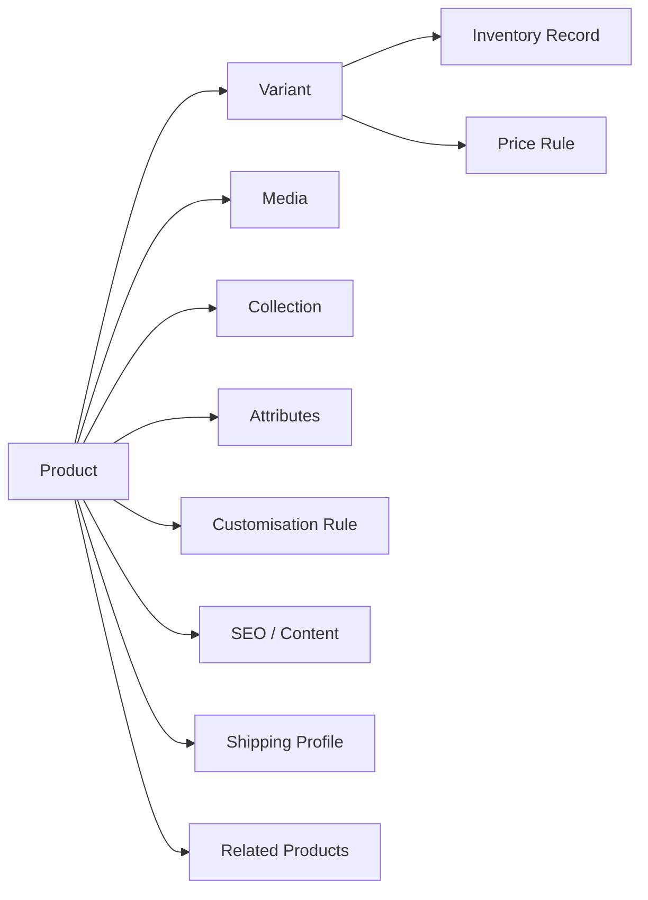

# Odhvica — Catalogue Model

| Field | Value |
|---|---|
| Document ID | 13 |
| Status | Approved catalogue foundation; detailed database mapping follows in Batch 3 |
| Version | 0.1 |
| Applies to | Odhvica reference catalogue and future independent client-store catalogues |
| Owner | Product owner / catalogue lead |
| Last updated | 2026-08-12 |

## 1. Purpose

This document defines the business-level catalogue model for Odhvica. It specifies how handmade-fashion products, variants, inventory, collections, media, customisation, pricing, publication and merchandising should behave before the detailed database schema is designed.

The model is built for products that may be unique, limited, ready to ship, made to order, variable in textile/print/finish, size-based, personalisable or measurement-driven. It must be flexible enough for future client stores while retaining an understandable product-management experience.

## 2. Catalogue Principles

| Principle | Requirement |
|---|---|
| Product truth | Storefront availability, price, description, lead time, variant selection and policy messaging must reflect the operational product record. |
| Handmade specificity | The model supports material/craft information, natural variation, one-of-a-kind items, production time and customer-provided requirements. |
| Variant precision | A sellable option must be identifiable, priced and available independently when business rules require it. |
| Controlled flexibility | Clients can configure their products without changing shared core behaviour; new attribute models require review. |
| Immutable order snapshot | Product/variant/customisation details accepted with an order remain preserved with that order even if the catalogue later changes. |
| Media quality | Product images are structured assets with order, alt text, focal point, usage and performance rules. |
| Search and discovery | Product/collection attributes support navigation, filters, internal search and SEO without creating inconsistent tags. |

## 3. Catalogue Entity Overview

The following conceptual entities will be translated into detailed schema and API contracts in later documentation.

| Entity | Purpose |
|---|---|
| Product | The customer-facing merchandise concept, story and shared product-level configuration. |
| Variant | A sellable combination such as size/colour/material/length with its own SKU, availability and optional price adjustment. |
| Attribute | Structured descriptive or filterable data such as material, style, occasion, fit or care. |
| Media asset | Product image/video with order, alt text, crop/focal point and association. |
| Collection | Curated or rule-driven product group used in navigation, merchandising and SEO. |
| Inventory record | Availability tracking for product/variant/unique-item state. |
| Customisation rule | Definition of required/optional customer input associated with a product or variant. |
| Price rule | Base price, variant adjustment, sale/reference price and promotional eligibility context. |
| Shipping profile | Product-level shipping data/eligibility where required. |
| Related-product link | Curated or rule-based merchandising relationship. |

## 4. Product Types

Odhvica must support the following product modes. A client may enable only the modes it needs.

| Product type | Description | Typical example |
|---|---|---|
| Standard physical product | Ready-to-ship item with simple stock/price | Tote bag with one option. |
| Variant physical product | Product with sellable option combinations | Jacket with size and colour variants. |
| One-of-a-kind product | Single unique item that cannot be oversold | Vintage Kantha jacket with unique print placement. |
| Made-to-order product | Item produced after purchase with configured lead time | Custom jacket made after order confirmation. |
| Personalised product | Product with custom text/monogram/gift fields | Tote bag with embroidered initials. |
| Measurement-based product | Garment requiring customer measurements or fit inputs | Custom-fit jacket or robe. |
| Pre-order product | Future availability item with defined expected fulfilment rule | Seasonal limited collection. |
| Gift product | Product or order with gift message/wrapping requirements | Gift-ready accessory. |

The initial reference store should prioritise standard, variant, one-of-a-kind, made-to-order, personalised and measurement-based physical products. Digital products, subscriptions and bundles are future/optional modules unless specifically approved.

## 5. Product Record

A product record defines the shared concept before variant-level differences are applied.

| Product field group | Required information |
|---|---|
| Identity | Internal ID, title, slug/URL, product type, status, brand/client context and publish date. |
| Merchandising | Collection/category assignment, tags, featured state, related products, badges and campaign association. |
| Customer content | Short description, full description, material, care, origin/process, handmade variation notice, fit and size guide reference. |
| Commerce | Base price, currency context, sale/reference-price configuration, tax/shipping profile and product eligibility controls. |
| Availability | Stock mode, made-to-order/pre-order status, production lead time, inventory handling and visibility state. |
| Customisation | Linked custom-input rules, validation, required/optional state, lead-time impact and customer guidance. |
| Media | Ordered gallery, primary image, alt text, focal points, video/visual content and asset status. |
| SEO | Metadata, canonical/indexation settings, structured page fields and social sharing content. |
| Operations | Internal notes, supplier/artisan reference where appropriate, audit timestamps and change ownership. |

## 6. Product Lifecycle

| Status | Storefront visibility | Admin rule |
|---|---|---|
| Draft | Not publicly purchasable | Editable; can be previewed by authorised users. |
| Review required | Not publicly purchasable unless configured otherwise | Await content/price/inventory/policy approval. |
| Active | Public and purchasable if sellable | Subject to inventory/region/payment rules. |
| Scheduled | Not yet public | Publication time is recorded and editable by authorised role. |
| Sold out | Public or hidden according to client configuration | Cart blocked; may show wishlist/back-in-stock path where enabled. |
| Archived | Not publicly purchasable | Retained for history/orders/reporting; restoration is controlled. |
| Deleted | Not shown | Only permitted when no historical/order/SEO retention conflict exists; default is archival. |

## 7. Variant Model

A variant represents the chosen purchasable option combination. Customers should see only meaningful, configured choices. Admin users must not be forced to create variant combinations that do not exist.

| Variant field | Requirement |
|---|---|
| Option values | Size, colour, material, length, lining, style or other approved configurable options. |
| SKU / internal reference | Unique operational identifier where inventory/fulfilment requires it. |
| Price adjustment | Optional increase/decrease relative to product base price; reflected in all purchase surfaces. |
| Availability | Active/inactive, stock level, one-of-a-kind state, preorder/made-to-order relation. |
| Media link | Variant-specific images where visual difference affects purchase decision. |
| Shipping data | Weight/dimensions/eligibility difference where variant changes fulfilment requirement. |
| Customisation relation | Variant may enable, disable or modify a product customisation requirement when approved. |
| Display order | Consistent customer-facing option order. |

### Variant UX Rules

| Rule | Requirement |
|---|---|
| Clear choice | Labels must be understandable; swatches alone are not sufficient where text is required for accessibility. |
| Availability | Unavailable values must be distinguishable and cannot be selected as sellable. |
| Price update | Variant price changes update before add-to-cart and carry to cart/checkout/order snapshot. |
| Image update | Variant selection updates associated media only when this improves clarity and does not disrupt customer control. |
| URL/share state | Product links should preserve a selected valid variant where technically appropriate. |
| Validation | Required variant choices must be complete before cart addition. |

## 8. Handmade Attributes and Disclosures

Handmade products often need more than generic tags. The following attributes should be structured where they affect customer understanding, filtering, SEO, operations or policy.

| Attribute category | Examples | Customer value |
|---|---|---|
| Material | Cotton, velvet, silk, recycled textile, handblock fabric | Helps customers assess feel, care and quality. |
| Craft/process | Kantha, Suzani embroidery, block print, quilting, hand finishing | Explains value and product character. |
| Fit/style | Free size, relaxed fit, cropped, longline, open front, reversible | Helps purchase decision. |
| Occasion | Travel, gifting, wedding, festive, everyday, layering | Supports merchandising and discovery. |
| Care | Hand wash, dry clean, storage/caution guidance | Reduces post-purchase uncertainty. |
| Variation | Pattern placement, hand-stitch variation, unique colour/texture variation | Sets accurate expectations. |
| Origin | Jaipur, artisan workshop, material source where verified | Supports trustworthy storytelling. |
| Lead time | Ready to ship, dispatched within configured period, made to order | Sets fulfilment expectation. |

Attributes used in customer filters must have controlled values. Freeform tags should not become the only mechanism for key product information.

## 9. Customisation and Measurement Model

Custom inputs must be configured as product rules rather than unstructured notes wherever they affect production or fulfilment.

| Custom input type | Example | Required model behaviour |
|---|---|---|
| Short text | Monogram, engraving, custom name | Character limit, allowed characters and customer guidance. |
| Long text | Order note, special request | Guidance, maximum length and non-guarantee disclaimer where appropriate. |
| Select / radio | Lining, strap, packaging, custom finish | Allowed values and optional price/lead-time impact. |
| Measurement fields | Chest, waist, sleeve, length | Units, validation range, measurement instruction and order snapshot. |
| File upload | Reference image or design note | File-type/size rule, privacy notice, access control and retention policy. |
| Gift message | Recipient message | Character limit, print/display/fulfilment instruction. |

A product customisation rule must define whether it is required, optional, variant-dependent, price-affecting, lead-time-affecting, displayed in cart/checkout/order, editable after order and visible to which staff roles.

## 10. Inventory Rules

| Inventory mode | Requirement |
|---|---|
| Tracked quantity | Quantity maintained at product or variant level; low-stock warning and oversell protection apply. |
| One-of-a-kind | Exactly one sellable unit; confirmed purchase consumes availability. |
| Made to order | Inventory may be untracked or capacity-driven, but production lead time and order workflow are mandatory. |
| Pre-order | Availability controlled by configured allocation/period and clear fulfilment expectation. |
| Manual adjustment | Authorised staff must provide reason; adjustment is recorded for audit/reporting. |
| Return/restock | Returned item restores availability only after approved receipt/inspection condition. |

Inventory display should be configurable. A store may show exact count, low-stock cue, made-to-order cue, sold-out state or no public count. It must not show availability that contradicts the operational record.

## 11. Pricing and Promotion Relation

Product and variant records provide base saleability; promotion logic is governed by `05_commerce_rules.md`.

| Price field | Rule |
|---|---|
| Base price | Required for a sellable product/variant in the configured store currency. |
| Variant adjustment | Applied predictably and recorded in cart/order snapshots. |
| Sale price | Must be valid, clearly displayed and governed by configured dates/eligibility. |
| Reference/original price | Used only when truthful and supported by approved commercial rules. |
| Cost/margin | Optional internal data; never exposed to customers. |
| Regional price | Future/advanced capability; requires explicit currency, tax and provider design. |

## 12. Product Media Requirements

| Media requirement | Rule |
|---|---|
| Primary image | Every active product has a clear primary visual suitable for card/listing use. |
| Gallery order | Images are intentionally sequenced to show product, detail, scale/fit, fabric/texture and variant differences as useful. |
| Alt text | Meaningful images receive accurate descriptive alt text; decorative images are correctly identified. |
| Variant media | Used when visual differences are material to selection. |
| Crop/focal point | Store visual crop intent without destroying source asset; support responsive display. |
| Rights | Only assets approved for the current client store are used. |
| Performance | Use optimised derivatives/responsive loading according to page importance. |

## 13. Collections, Categories and Tags

| Mechanism | Purpose | Governance |
|---|---|---|
| Category | Stable high-level product taxonomy | Limited controlled set for navigation and reporting. |
| Collection | Curated/rule-driven group for merchandising, campaigns and SEO | Defined ownership, publication state and product rule. |
| Tag | Internal or supplemental descriptor | Controlled vocabulary for reusable operational/search use. |
| Attribute | Structured customer/filter/SEO fact | Defined values and applicable product types. |
| Campaign relation | Links products to time-bound storytelling/promotion | Must not silently alter product availability or price. |

## 14. Import, Export and Migration Requirements

Future client onboarding may require product import/migration. The system must provide a controlled process for mapping source fields to the Odhvica catalogue model.

| Requirement | Rule |
|---|---|
| Import template | Define fields, accepted formats, validation and error reporting. |
| Media migration | Preserve asset ownership, association, order, alt text and upload status. |
| Variant mapping | Validate option combinations, SKUs, availability and price data before publish. |
| Product content | Map descriptions, materials, care and SEO content into structured fields where possible. |
| Review state | Imported products should be reviewable before bulk public publication. |
| Export | Authorised users may export approved catalogue data; sensitive/internal fields follow permission policy. |

## 15. Catalogue Acceptance Criteria

The catalogue model is acceptable when an authorised admin can create a handmade product with accurate content, media, variants, stock/made-to-order state, price, custom input and collection placement; publish it safely; and a customer can discover, select and purchase it with all required details preserved in the order.

## Related Documents

`03_prd.md` defines product requirements. `05_commerce_rules.md` defines pricing/order/shipping behaviour. `09_storefront_ux.md` defines customer presentation. `10_admin_ux.md` defines product-management UX. `12_content_model.md` defines editorial content. `14_seo_analytics.md` defines product discovery/measurement. Detailed implementation follows in `18_db_schema.md` and `19_api_contracts.md`.
