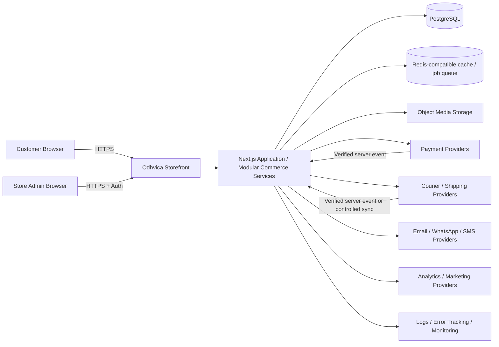
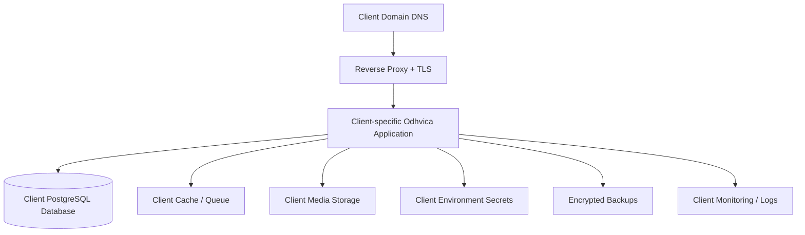
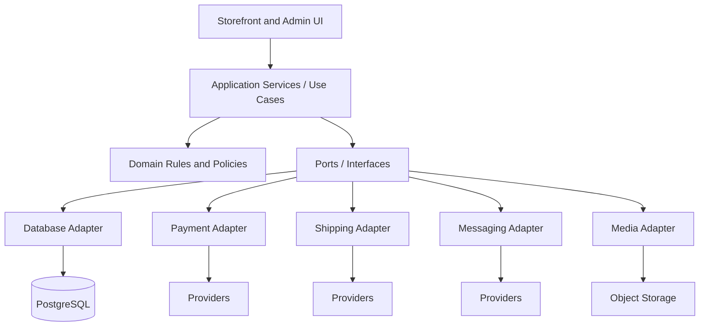
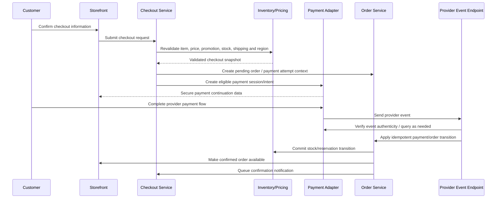

# Odhvica — Architecture Design

| Field | Value |
|---|---|
| Document ID | 16 |
| Status | Approved architectural direction; implementation details subject to later ADRs and provider validation |
| Version | 0.1 |
| Product | Odhvica reusable single-store e-commerce template |
| Deployment target | Independent client deployments compatible with Hostinger VPS |
| Owner | Technical lead |
| Last updated | 2026-08-12 |

## 1. Purpose

This document defines the high-level architecture for Odhvica: a performance-oriented, SEO-first, full-stack commerce application for handmade-fashion stores. The design supports one protected master template that is used to launch independent client stores. Each client store is a separate deployed application with separate data, secrets, domain, payment accounts, media and operational history.

The architecture intentionally uses a modular monolith for the initial product rather than a distributed microservices estate. A modular monolith keeps deployment, debugging, release control, security and VPS operations manageable while still separating commerce domains cleanly. Modules may later be extracted only when a proven scale, isolation or operational need requires it.

## 2. Architectural Goals

| Goal | Architectural response |
|---|---|
| Fast SEO-ready storefront | Server-rendered and cache-aware public pages built with a Next.js-first architecture. |
| Reliable commerce | Explicit service modules for catalogue, cart, checkout, orders, payments, inventory, shipping and customer identity. |
| Client independence | Separate repository/project, database, storage namespace, environment, domain and provider credentials for each client store. |
| Storefront redesign freedom | Customer-facing UI consumes stable domain/application contracts rather than duplicating business rules. |
| Consistent admin | One reusable role-aware operations interface built on the same application services. |
| Secure integrations | Server-side provider boundaries, webhook/event verification, secret isolation and audit-friendly state changes. |
| VPS compatibility | Containerised or process-managed deployment behind a reverse proxy with separate database, media, backup and monitoring concerns. |
| Future mobile readiness | Application/domain APIs remain usable by future Android/iOS clients without turning the initial build into an API-only project. |

## 3. Architectural Principles

| Principle | Requirement |
|---|---|
| Modular monolith first | Keep related business logic in one deployable application with explicit module boundaries. |
| Domain rules on server | Price, stock, promotion, order, payment and permission decisions are authoritative on the server. |
| UI is not the business layer | Storefront/admin components display state and request actions; they do not become the only implementation of commerce rules. |
| Database is source of record | Orders, inventory, customers, products, payment state and operational transitions are persisted transactionally. |
| Asynchronous external work | Provider callbacks, email, tracking sync, media processing and retryable tasks use explicit asynchronous patterns. |
| Secure by default | Secrets are server-only, roles are checked at every protected action, and external events are verified. |
| Configurable, not hard-coded | Brand, regional, payment, shipping, content and integration settings are environment/client configuration. |
| Observable failure paths | Payments, orders, webhooks, jobs and integrations record structured status and actionable errors. |
| Cache safely | Cache public read paths; invalidate/revalidate when content, product, price or stock changes. Never treat cache as authoritative commerce state. |

## 4. Proposed Technology Direction

The following is the recommended initial direction. Exact package/tool choices must be confirmed through implementation ADRs and compatibility validation before coding begins.

| Layer | Proposed direction | Reason |
|---|---|---|
| Web application | Next.js-first application using TypeScript | SEO-friendly public rendering, full-stack capability, strong ecosystem and one codebase for storefront/admin. |
| Server runtime | Node.js LTS runtime | Compatible with Next.js and mainstream VPS/container deployment. |
| Data store | PostgreSQL | Transactional relational model appropriate for orders, payments, inventory, users and reporting. |
| Data access | Type-safe ORM/query layer selected through ADR | Enforces schema/migrations and isolates data access. |
| Cache/queue | Redis-compatible service when justified | Supports rate limits, short-lived cache, locks, jobs and retryable integration work. |
| Media storage | S3-compatible object storage or controlled VPS object/media service | Separates product media from application container and supports optimisation/backups. |
| Search | Database-backed search first; external search only when proven necessary | Reduces first-release operational complexity. |
| Reverse proxy / TLS | Nginx or equivalent reverse proxy with automated certificate renewal | Terminates HTTPS, handles proxy routing, headers and static/media policy. |
| Deployment | Containerised application with environment-specific configuration; VPS process/compose management | Repeatable isolated deployments and rollback-friendly releases. |
| Monitoring | Structured logs, health checks, error tracking and backup monitoring | Required for commerce reliability and support. |

## 5. System Context

The browser communicates only with the client’s Odhvica application over HTTPS. Sensitive payment, provider and data operations are completed server-side. Provider callbacks enter dedicated verified endpoints and are translated into controlled internal events; they do not directly mutate business records without validation.

## 6. Deployment Topology Per Client

Every client receives a separate deployment topology. The exact VPS size may differ by catalogue/media/traffic needs, but the logical boundary remains the same.

| Asset | Separation rule |
|---|---|
| Application deployment | One production deployment per client; Odhvica reference store remains separate. |
| Environment variables | Separate file/secret store per client and per environment; never copied from another production store. |
| Database | Separate client database or equally strong dedicated isolation boundary; no shared production customer/order data. |
| Media | Separate media namespace/bucket/path and access permissions. |
| Payments | Client-owned provider account and credentials. |
| Domain/TLS | Client-specific domain, certificate and redirect configuration. |
| Logs/backups | Client-scoped retention/access; no cross-client visibility. |

## 7. Application Modules

The application is organised around business domains. A module owns its business rules, data access, validation and server-side operations. UI components consume module services through approved interfaces.

| Module | Responsibilities |
|---|---|
| Identity and access | Customer/admin authentication, password recovery, sessions, roles, permissions and access audit. |
| Store configuration | Client store profile, regional settings, currencies, tax/shipping settings, feature flags and integration configuration references. |
| Catalogue | Products, variants, attributes, collections, media metadata, customisation rules, product publication and search data. |
| Content | Pages, campaigns, navigation, homepage blocks, policy content, SEO metadata and publication workflow. |
| Inventory | Stock modes, stock quantities, reservations, adjustment log, low-stock alerts and one-of-a-kind control. |
| Pricing and promotions | Prices, variant adjustments, sale/reference prices, discount codes, automatic promotions, eligibility and price snapshots. |
| Cart | Customer/guest carts, line items, variant/customisation validation, price/availability refresh and cart lifecycle. |
| Checkout | Address, shipping eligibility, totals, payment-method eligibility, order initiation and error recovery. |
| Orders | Order records, state transitions, item snapshots, customer communication, cancellation/return/exchange request context. |
| Payments | Provider adapters, payment intent/session creation, verified callbacks, refund actions, reconciliation and failure handling. |
| Fulfilment and shipping | Shipping methods, production state, fulfilment, courier integration, tracking, label/pickup optional module and delivery status. |
| Customer relationship | Customer profile, addresses, consent, wishlist, reviews, support interactions and privacy requests. |
| Notifications | Transactional email/WhatsApp/SMS event rendering, queueing, delivery status and templates. |
| Reporting and analytics | Commerce reporting, controlled event emission, data aggregation and admin reporting views. |
| Operations | Background jobs, health checks, audit log, feature flags, error handling and maintenance tasks. |

## 8. Layered Internal Design

This layering prevents provider-specific or UI-specific decisions from being embedded directly in the core commerce rules. It also makes future provider replacement, client-specific integration configuration and testing more manageable.

## 9. Critical Commerce Flow: Checkout to Order

Important constraints: totals are recalculated server-side; payment client redirects alone are not treated as final proof; provider events are verified and idempotent; order state, payment state and fulfilment state remain separate; stock changes follow confirmed/order-policy transitions; notifications are asynchronous and retryable.

## 10. Data and Transaction Strategy

PostgreSQL is the authoritative store for operational commerce data. Database transactions must be used for tightly coupled changes such as order-state updates, payment transition recording, inventory reservation/consumption, promotion usage and audit records where appropriate.

External calls cannot participate in the same database transaction. The application therefore uses durable event/outbox-style patterns for work that must happen after a record change, including confirmation messages, analytics emission, cache invalidation, provider reconciliation or shipment updates. Later system-design and schema documents define the exact pattern.

## 11. Caching and Rendering Strategy

| Surface | Strategy |
|---|---|
| Home/collections/editorial pages | Server-rendered/cached where safe; revalidate on approved content/catalogue publication. |
| Product detail | Server-rendered with controlled cache and targeted invalidation when price, availability, content or media changes. |
| Search/filter | Dynamic request path with controlled query validation; cache where validated and appropriate. |
| Cart/checkout/account/admin | Dynamic and authenticated/personalised; no shared public cache. |
| Images/media | Responsive, optimised delivery through approved media storage/optimisation path. |
| Provider callbacks | No cache; signature/verification and idempotency required. |

## 12. Security and Trust Boundaries

| Boundary | Architectural control |
|---|---|
| Public browser to application | HTTPS, secure headers, input validation, rate control and server-side business authority. |
| Customer/admin authentication | Secure session/token design, password handling, role checks and audit events. |
| Admin privileges | Permission checks at service/action level; UI visibility is not the only protection. |
| Application to database | Least-privilege credentials, encrypted connection where supported, migration control and backup strategy. |
| Application to providers | Server-only secrets, provider adapter boundary, timeouts, retries and verified callbacks. |
| Uploaded files | Type/size validation, isolated storage, controlled access/URLs and malware/abuse strategy to be finalised. |
| Background workers | Idempotent jobs, limited permissions, retries/backoff and observable failure state. |
| Client isolation | Separate data/secrets/deployment; no shared mutable production data plane. |

Detailed security controls are defined in `21_security_blueprint.md`.

## 13. Scalability and Evolution

The initial architecture prioritises a reliable vertical scale path on client-specific VPS deployments. Scale decisions must be evidence-driven. Possible later evolution includes a managed database, CDN/object storage, dedicated search, separate job worker, read replica or extraction of high-volume integration/notification services.

Do not introduce microservices, a shared multi-tenant database, or an event-stream platform merely to appear advanced. Each additional system must solve a confirmed capacity, isolation, deployment, uptime or developer-velocity problem.

## 14. Future Mobile Clients

Future Android/iOS clients should consume the same application/service contracts used by the storefront and admin. The architecture must avoid placing essential business logic only inside page components. Mobile applications are deferred; no mobile-specific backend complexity should delay the web reference store.

## 15. Architecture Decisions Pending

| Decision | Required before implementation |
|---|---|
| ORM/query layer | Compare migration safety, type safety, testability and team familiarity. |
| Authentication provider/mechanism | Define customer/admin session, OAuth if any, password policy and role model. |
| Media storage approach | Validate Hostinger VPS/object-storage option, backup, image optimisation and access rules. |
| Redis/job approach | Confirm whether first release needs a dedicated service or simpler reliable job pattern. |
| Search approach | Validate database search sufficiency against expected catalogue/traffic. |
| Monitoring/error service | Select log, error and uptime approach compatible with client data/privacy needs. |
| Deployment implementation | Confirm container/process manager, reverse proxy, CI/CD, secrets and rollback tooling. |
| Provider workflows | Validate payment/shipping/email APIs, callback support, eligibility and failure paths. |

## 16. Architecture Acceptance Criteria

The architecture is acceptable when one client store can be deployed independently; public pages remain performant and search-friendly; commerce rules run authoritatively on the server; orders/payments/inventory remain consistent; provider failures are observable and recoverable; client data and secrets are isolated; and future storefront redesign/mobile clients can consume stable business interfaces.

## Related Documents

`01_project_summary.md` through `08_agent.md` define product/reuse rules. `09_storefront_ux.md` through `15_accessibility.md` define UX/data presentation. `17_system_design.md`, `18_db_schema.md`, `19_api_contracts.md`, `20_integration_spec.md`, `21_security_blueprint.md`, `22_performance_plan.md`, `23_folder_structure.md` and `24_reference_implementation.md` refine this architecture.
