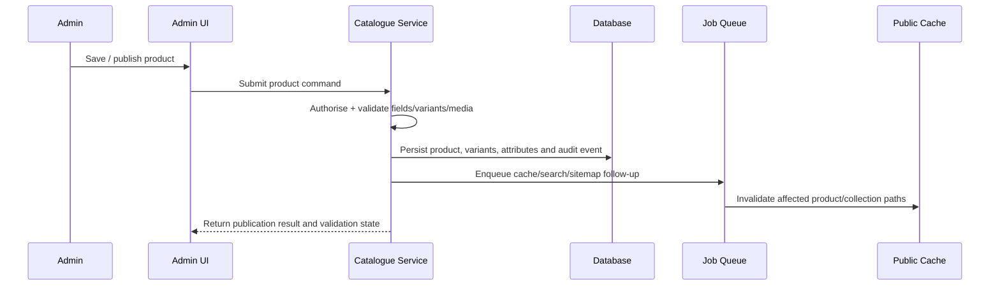
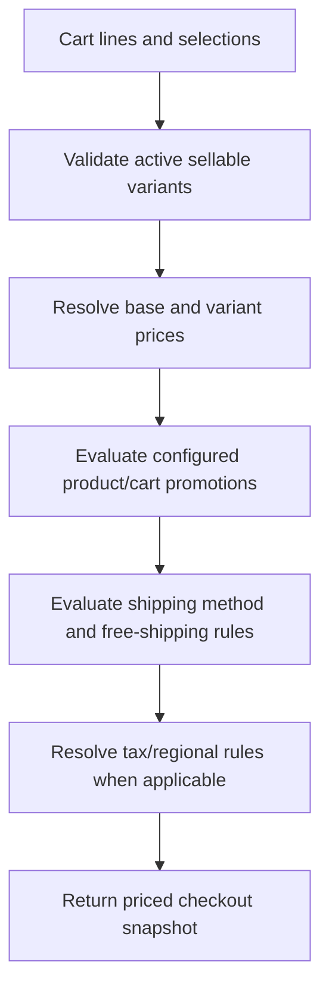
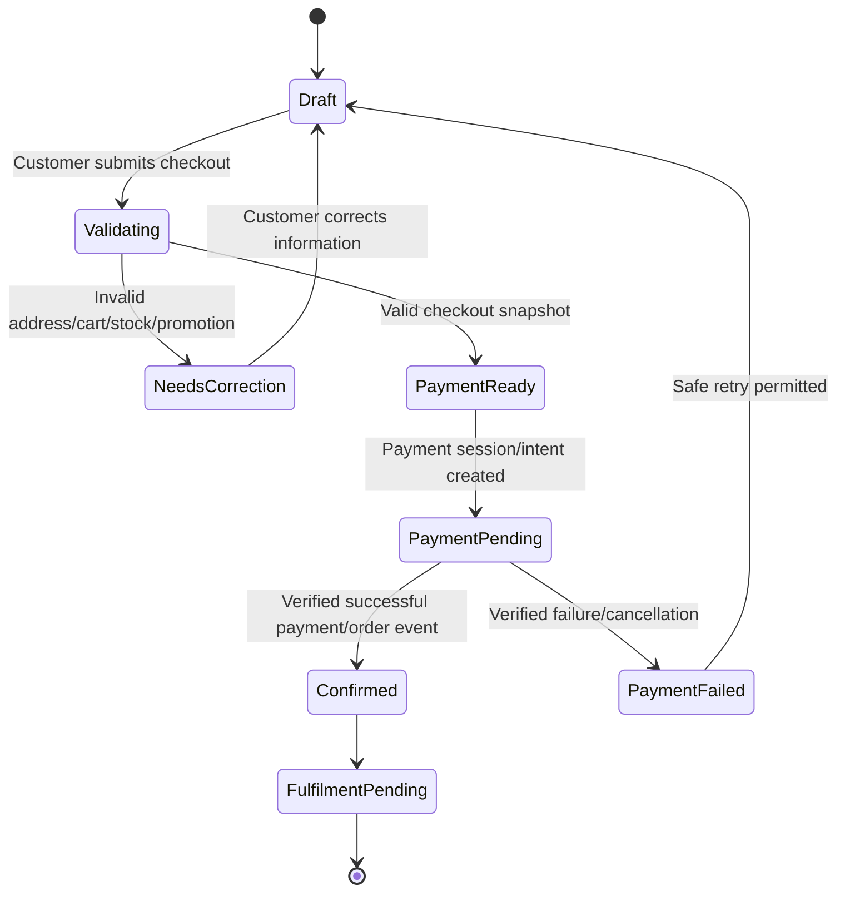

# Odhvica — System Design

| Field | Value |
|---|---|
| Document ID | 17 |
| Status | Approved system-design foundation; exact schemas/endpoints follow linked documents |
| Version | 0.1 |
| Product | Odhvica reusable handmade-fashion e-commerce template |
| Owner | Technical lead |
| Last updated | 2026-08-12 |

## 1. Purpose

This document turns the high-level architecture into operational system behaviour. It defines how Odhvica processes catalogue changes, carts, checkout, price/stock validation, payments, orders, fulfilment, notifications, content publication, integrations, background jobs and failure recovery.

The system is designed for a modular monolith deployed independently for each client. It is not a shared multi-tenant runtime. All examples in this document refer to one isolated client store deployment.

## 2. Core System Invariants

| Invariant | Required behaviour |
|---|---|
| Server authority | Browser state is never authoritative for price, stock, discount, tax, shipping, payment or permission decisions. |
| Order snapshot | A confirmed order stores the accepted product, variant, customisation, price, discount, currency, tax, shipping and customer-delivery snapshot. |
| Separate states | Order, payment, fulfilment and post-purchase request states remain separate records/fields with controlled transitions. |
| Verified payments | Provider redirect/UI success alone is insufficient; final payment-related transition uses verified provider/server evidence. |
| Idempotent events | Repeated provider callbacks, customer retries and job retries must not create duplicate orders, refunds, stock reductions or notifications. |
| Inventory integrity | Stock/reservation change is transactional and prevents oversell of tracked/unique items. |
| Auditable change | Sensitive/operational actions record actor, time, relevant before/after state and reason where required. |
| Configuration isolation | Client secrets and business settings are used only in the relevant deployment/environment. |
| Failure visibility | External failure/retry states are recorded; errors are not silently swallowed. |

## 3. Request and Processing Types

| Processing type | Examples | Design rule |
|---|---|---|
| Public read | Home, collection, product detail, content pages | Cacheable when public and invalidated safely on content/catalogue change. |
| Authenticated read | Account, order history, admin lists | Authorise before query; no shared public cache. |
| Interactive write | Add cart item, product edit, discount create, order support action | Validate input, authorise actor, apply transaction/policy and return controlled result. |
| Commerce-critical write | Checkout start, payment confirmation, refund, stock adjustment, fulfilment update | Require strong validation, idempotency, audit and test coverage. |
| External callback | Payment event, courier event, provider delivery status | Verify origin, deduplicate, map to internal event and process safely. |
| Background job | Email delivery, cache invalidation, reconciliation, media processing, retry | Durable job record, retry/backoff, idempotency and observable dead/failed state. |
| Scheduled operation | Expire carts, campaign change, stock alert, report aggregation | Time-aware and idempotent; use client-specific configuration. |

## 4. Domain Service Responsibilities

| Service | Key commands | Key read models |
|---|---|---|
| Catalogue service | Create/edit/publish/archive product, manage variants/media/attributes/custom rules | Product detail, collection listing, catalogue admin views |
| Inventory service | Reserve, release, consume, adjust, restore, alert | Sellable availability, inventory list, adjustment history |
| Pricing service | Price product/variant, apply promotion, calculate cart/checkout totals | Price breakdown, promotion eligibility/result |
| Cart service | Create/retrieve cart, add/update/remove item, apply code, refresh snapshot | Customer/guest cart and cart-line validation state |
| Checkout service | Validate address/region/shipping/payment eligibility, begin checkout | Checkout summary, method eligibility, error/recovery state |
| Order service | Create pending/confirmed order, state transition, cancellation/request management | Order summary, timeline, order history, admin queue |
| Payment service | Create provider session/intent, accept verified event, refund/reconcile | Payment record, provider attempt/status, refund state |
| Fulfilment service | Create production/fulfilment activity, ship, track, resolve return/exchange | Fulfilment queue, tracking state, production status |
| Customer service | Profile/address/consent/wishlist/review/support operations | Customer profile and customer timeline |
| Content service | Draft/review/publish pages, navigation, campaign and SEO metadata | Public content pages and admin content list |
| Notification service | Render/queue/send transactional message and record delivery result | Message history and exception queue |
| Reporting service | Build controlled operational aggregates and exports | Dashboard/report datasets |

## 5. Catalogue Publication Flow

Publishing must not expose an active product with missing required price, availability, media, product information, policy-required disclosure or invalid variant configuration. The validation result should identify the exact field/section requiring correction.

## 6. Cart Design

A cart is a mutable, customer/guest-scoped purchase draft. Its line items contain a product/variant reference plus a point-in-time selection snapshot. Its price, discount, availability and shipping context are revalidated whenever material checkout decisions occur.

| Cart rule | System behaviour |
|---|---|
| Guest identity | Use a secure opaque cart/session identifier; do not expose internal customer/cart keys. |
| Customer identity | Merge/associate carts only through defined authenticated rules; avoid accidental loss/duplication. |
| Add item | Validate active product, sellable variant, required custom inputs and product-region eligibility. |
| Update quantity | Revalidate stock, price/promotion conditions and product limits. |
| Custom input | Store validated customisation in cart line; preserve through checkout and order snapshot. |
| Price refresh | Calculate server-side; mark/explain changes when customer needs revalidation. |
| Cart expiry | Define retention and cleanup policy; expiry is not cancellation of any order. |
| Concurrency | Use version/locking or controlled retry where two actions modify the same cart. |

## 7. Pricing and Promotion Evaluation

The pricing service produces a deterministic checkout price breakdown from current valid records. It must not depend on browser-submitted totals.

| Rule | Requirement |
|---|---|
| Determinism | Same valid inputs/configuration produce the same price breakdown. |
| Traceability | Order snapshot records applied promotion/rule identifiers and monetary components. |
| Currency | Use configured monetary precision/rounding rules consistently across product/cart/checkout/order/refund. |
| Stacking | Follow explicit precedence; no hidden double discount. |
| Eligibility | Evaluate product, collection, customer, date, cart, region, method and usage conditions server-side. |
| Expiry/change | Revalidate before payment; report changed/invalid promotion without corrupting cart. |

## 8. Checkout State Machine

Checkout must preserve a stable quote/snapshot long enough to complete the provider flow while revalidating sensitive conditions at the point defined by the payment/order policy. If a material condition changes, the customer must receive a clear correction/retry path rather than a misleading success state.

## 9. Payment Processing Design

Payment-provider integration is isolated behind a payment adapter interface. The adapter creates provider-specific payment sessions/intents, maps provider statuses to internal payment states, verifies callbacks, exposes refund operations and records provider references without leaking secret data to the client.

| Stage | Required behaviour |
|---|---|
| Payment eligibility | Select method/provider based on client configuration, region, currency, cart/checkout state and provider capability. |
| Initiation | Generate an internal payment attempt tied to checkout/order context; use idempotency key where provider supports it. |
| Browser hand-off | Return only safe provider/client continuation information; do not expose server secrets. |
| Callback verification | Verify signature/authenticity and, where necessary, reconcile/query provider state before applying transition. |
| Deduplication | Store provider event/reference identifiers; duplicate callback is a safe no-op. |
| Confirmation | Update payment and order state atomically according to internal policy; schedule notification/inventory actions. |
| Failure | Record reason category, leave recoverable order/cart context where appropriate, communicate safe retry action. |
| Refund | Create a controlled refund request/action, map provider result, update payment/order timeline and notify customer. |
| Reconciliation | Surface mismatched/pending/unresolved provider records in a restricted operations queue. |

## 10. Order and Fulfilment State Design

An order is an immutable customer/commercial snapshot plus controlled mutable lifecycle records. The system separates the customer’s commercial commitment from the physical production/delivery process.

| Area | System rule |
|---|---|
| Order creation | Create after valid checkout/payment-policy condition; ensure unique idempotency relationship to checkout/payment attempt. |
| Line snapshots | Preserve name, variant, media reference/context, price, taxes, shipping, discount and customisation at time of order. |
| Production | Made-to-order/custom orders may enter review/production before packing; this is separate from payment status. |
| Fulfilment | One order can support one or more fulfilment records only when explicitly enabled. |
| Tracking | Tracking data belongs to shipment/fulfilment record, not a mutable free-text order field alone. |
| Cancellation | Validate state, policy and authorisation before cancellation; inventory/payment/notification effects are controlled. |
| Return/exchange | Treat as request/workflow records linked to original order item; do not overwrite original order truth. |
| Refund | Payment operation and customer-support decision are represented separately but linked. |

## 11. Inventory and Concurrency Design

Inventory correctness is critical for limited and one-of-a-kind handmade products. The system must avoid a “last item sold twice” outcome when two customers checkout simultaneously.

| Situation | Required control |
|---|---|
| Add to cart | May show availability but does not guarantee purchase unless reservation policy says otherwise. |
| Checkout validation | Recheck live sellable stock/variant state immediately before payment/order commitment. |
| Reservation | If used, reservation has bounded expiry, clear release rules and transactional update. |
| Confirmation | Consume/reserve stock through a transaction coupled to valid order/payment transition. |
| Failed/cancelled payment | Release temporary reservation according to defined policy. |
| Manual adjustment | Role-authorised, reason-recorded and auditable. |
| Return inspection | Restore stock only after approved physical/quality condition. |
| Made to order | Track capacity/lead time/production state even where stock quantity is not the limiter. |

## 12. Asynchronous Work and Outbox Pattern

The application must not make a successful customer/order transaction depend on an email provider, analytics provider or cache service responding synchronously. After a durable domain change, the system records a follow-up event/job in the same database transaction or equivalent durable mechanism.

| Event | Typical asynchronous consumers |
|---|---|
| ProductPublished | Public cache invalidation, sitemap/search update, analytics/content operations. |
| OrderConfirmed | Confirmation email, admin notification, inventory follow-up, analytics purchase event. |
| PaymentFailed | Customer recovery notification where permitted, operations exception tracking. |
| FulfilmentShipped | Tracking message, customer status update, analytics/operations metrics. |
| RefundCompleted | Customer notification, reporting update, support timeline. |
| ContentPublished | Cache invalidation, sitemap refresh, preview/publication audit. |
| IntegrationFailed | Retry scheduler, operations alert, structured error report. |

Jobs must have unique identity/idempotency behaviour, retry policy, exponential/backoff-style delay where appropriate, maximum attempt/dead-letter handling, and an admin/operations view for unresolved failures.

## 13. Content and Cache Invalidation

Public pages can use cached rendering only if cache invalidation is tied to relevant data changes. Invalidation scope must be precise enough to prevent stale price/availability/content yet avoid global purge for routine edits.

| Change | Affected cache/read surfaces |
|---|---|
| Product title/description/media/SEO | Product page, relevant collection cards, search index/results and sitemap data. |
| Variant price/availability | Product page, cart/checkout validation remains dynamic, relevant listing card and search data. |
| Collection change | Collection page, home/campaign blocks that reference it, navigation if applicable. |
| Homepage/campaign publish | Home and affected campaign/landing routes. |
| Shipping/promotion configuration | Cart/checkout uses dynamic validation; public promotion message surface if applicable. |
| Policy/page update | Relevant public page and footer/navigation cache. |

## 14. Error and Retry Design

| Error category | Customer/admin response | System response |
|---|---|---|
| Validation error | Explain the correctable field/condition | Do not create partial invalid state. |
| Authorisation error | Explain unavailable action without revealing protected data | Log denied attempt where appropriate. |
| Expected provider failure | Clear retry/alternate action | Record provider status and retry/reconcile only through safe policy. |
| Transient system failure | Preserve work where possible and provide retry/support path | Retry background work; alert if threshold exceeded. |
| Permanent configuration failure | Admin/owner action required | Mark integration unhealthy; prevent misleading customer flow. |
| Data integrity conflict | Explain refresh/retry to user | Use transaction/locking strategy and audit. |
| Unknown server error | Generic safe customer message | Correlated structured log/error record; no stack/secret exposure. |

## 15. Authorization Model

All protected commands must evaluate the authenticated actor, client/store deployment boundary, role, operation and target record. UI visibility is an aid, not a permission check. Customer ownership checks apply to cart, account, order and request actions. Staff permissions apply to catalogues, orders, refunds, content, reports and settings.

The system should apply least privilege and deny by default. High-impact operations—refund, deletion/archive, user role changes, integration configuration, payment configuration, export of customer data and production deployment actions—require elevated permissions and audit records.

## 16. Observability Requirements

| Signal | Requirement |
|---|---|
| Request logs | Structured request ID, route/module, actor class, result category, duration and safe error context. |
| Domain audit | Product publication, price changes, inventory adjustments, order/payment/fulfilment/refund transitions and settings changes. |
| Provider events | Provider reference, verification outcome, idempotency result, mapped internal action and error/retry state. |
| Job health | Queue depth, success/failure/retry/dead status and processing latency. |
| Application health | Liveness/readiness/dependency health endpoints safe for monitoring. |
| Business exceptions | Unfulfilled paid orders, failed notifications, pending payments, stock conflict, failed shipping sync and refund exception queues. |

## 17. System Acceptance Criteria

The system design is acceptable when it preserves commerce correctness under normal and repeat/failure conditions: a valid product can be added to cart, recalculated at checkout, paid through an eligible verified provider path, converted into exactly one correct order, fulfilled with correct customisation/stock data, and followed by recoverable notifications/reporting. Admin changes must be authorised, auditable and reflected safely in public read paths.

## Related Documents

`16_architecture_design.md` provides the high-level boundaries. `18_db_schema.md` maps domain data. `19_api_contracts.md` defines public/internal service interfaces. `20_integration_spec.md` defines providers. `21_security_blueprint.md` defines controls. `22_performance_plan.md`, `23_folder_structure.md` and `24_reference_implementation.md` provide supporting requirements.
