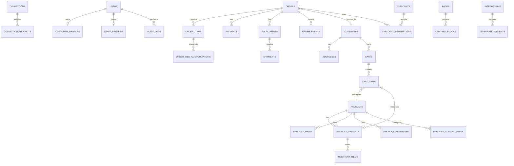

# Odhvica — Database Schema Specification

| Field | Value |
|---|---|
| Document ID | 18 |
| Status | Approved conceptual schema; physical migrations and field types to follow implementation ADRs |
| Version | 0.1 |
| Database direction | PostgreSQL per independently deployed client store |
| Owner | Technical lead / data owner |
| Last updated | 2026-08-12 |

## 1. Purpose

This document defines the conceptual relational data model for Odhvica. It maps the product, catalogue, cart, checkout, order, payment, fulfilment, customer, content, configuration, integration and audit requirements into persistent entities and relationships.

Each client store has an independent database or equivalently dedicated production isolation boundary. This schema is therefore designed for one store deployment. It does not require a shared multi-tenant production `tenant_id` model. A `store`/configuration record may exist for local application configuration, but it is not a mechanism for mixing several clients’ customer/order data in one live database.

## 2. Data Design Principles

| Principle | Requirement |
|---|---|
| Relational source of truth | PostgreSQL stores authoritative operational commerce records. |
| Stable identifiers | Use opaque internal identifiers and public-friendly order/reference identifiers separately where appropriate. |
| Money correctness | Store monetary amounts with currency code and deterministic precision; never use floating-point business totals. |
| Time correctness | Store timestamps in UTC; present localised time only at the UI layer. |
| Snapshot integrity | Orders retain product, price, discount, address, shipping and customisation snapshots accepted at purchase time. |
| Soft lifecycle | Archive/disable where historical order/reporting integrity matters; avoid destructive delete for referenced records. |
| Auditability | Record sensitive/status/financial/inventory/configuration changes with actor and reason context. |
| Least data | Persist only customer and operational data required for commerce/service/compliance; define retention/deletion policy. |
| Client isolation | Database credentials, backups and access are separate per client deployment. |

## 3. Naming and Common Columns

| Convention | Rule |
|---|---|
| Table naming | Plural snake_case table names; singular domain language in application code where preferred. |
| Primary key | Stable opaque ID, generated server-side. |
| Public IDs | Separate human-readable/reference fields for orders, invoices or customer-visible records. |
| Timestamps | `created_at`, `updated_at`; add `published_at`, `archived_at`, `deleted_at` or state timestamps only where meaningful. |
| Actor tracking | `created_by`, `updated_by`, `performed_by` references for auditable staff/system actions where appropriate. |
| Currency | ISO-style currency code stored with monetary records/snapshots. |
| State values | Controlled enums/lookups; avoid arbitrary text state fields. |
| JSON use | Use structured JSON only for flexible snapshots, provider payload fragments or controlled custom fields; not as a replacement for core relational entities. |
| Deletion | Use archival/soft deletion for data referenced by orders, reports or audit history. |

## 4. High-Level Entity Relationship Diagram

The diagram is conceptual. Join tables, lookup tables, explicit snapshots and history tables may expand the physical schema where required for correctness.

## 5. Store Configuration and Access Entities

| Table / entity | Key fields | Purpose |
|---|---|---|
| `stores` | id, display_name, legal_name, base_country, base_currency, status, timestamps | One local store identity/configuration record per isolated deployment. |
| `store_settings` | store_id, setting_key, structured_value, version, timestamps | Controlled non-secret application/store settings; secrets are referenced outside normal table content where possible. |
| `users` | id, email, password/auth reference, status, last_login_at, timestamps | Shared identity record for customer/staff account types. |
| `customer_profiles` | user_id, name fields, phone, marketing preferences reference, timestamps | Customer-facing account profile. |
| `staff_profiles` | user_id, display_name, employment/status metadata | Store staff identity context. |
| `roles` | id, code, name, description | Controlled role definition. |
| `permissions` | id, code, description | Controlled permission catalogue. |
| `user_roles` | user_id, role_id, assigned_by, timestamps | Role assignment history/current state. |
| `role_permissions` | role_id, permission_id | Permission composition. |
| `sessions` | user_id, secure session reference, expiry/revocation data | Authentication-session persistence if required by selected auth design. |
| `consents` | customer/user reference, consent_type, status, source, timestamp, policy_version | Consent/audience evidence. |

Password hashes, authentication provider identifiers and sensitive security material must follow the selected authentication design. Plaintext credentials, payment secrets and provider private keys must never be persisted in ordinary application rows.

## 6. Catalogue Entities

### 6.1 Core Product Tables

| Table / entity | Key fields | Notes |
|---|---|---|
| `products` | id, title, slug, product_type, status, short_description, description, base_price_amount, currency_code, sale fields, stock_mode, lead_time, publication fields | Product-level customer and commerce concept. |
| `product_variants` | id, product_id, title/suffix, SKU, status, price_adjustment_amount, compare/reference price fields, option signature, shipping data, timestamps | Sellable option combination where relevant. |
| `product_options` | id, product_id, name, display_order | Defines selectable option dimensions, such as Size or Color. |
| `product_option_values` | id, option_id, label, value/code, display_order, color metadata optional | Controlled selectable values. |
| `variant_option_values` | variant_id, option_value_id | Maps variants to selected option combinations. |
| `product_attributes` | product_id, attribute_type, controlled_value/reference, display_order | Material, craft, fit, care, occasion, origin and other structured facts. |
| `product_media` | id, product_id, media_asset_id, variant_id optional, display_order, role, alt_text, focal_point, status | Ordered product/gallery media relationship. |
| `product_custom_fields` | id, product_id, variant_id optional, input_type, label, instruction, required, validation, price/lead-time effect, display_order | Defines personalisation, measurement, note or file-upload requirements. |
| `product_relations` | product_id, related_product_id, relation_type, display_order | Complete-the-look, related, cross-sell or replacement relationship. |
| `product_seo` | product_id, meta_title, meta_description, canonical override, robots state, structured-data overrides | Product SEO configuration. |

### 6.2 Collections and Discovery

| Table / entity | Key fields | Notes |
|---|---|---|
| `categories` | id, parent_id optional, title, slug, status, display_order | Stable hierarchy for main product taxonomy. |
| `collections` | id, title, slug, type, status, description, media reference, SEO fields, publication timestamps | Curated/rule-driven public collection. |
| `collection_products` | collection_id, product_id, display_order, manual/automatic source | Explicit membership/ordering. |
| `tags` | id, normalized_name, display_name, status | Controlled tag library. |
| `product_tags` | product_id, tag_id | Product/tag relation. |
| `search_documents` or equivalent | product/page/collection reference, searchable text, status, updated_at | Denormalised/search-index source if database search strategy requires it. |

## 7. Media and Content Entities

| Table / entity | Key fields | Purpose |
|---|---|---|
| `media_assets` | id, storage_key, media_type, file metadata, width/height/duration, source, rights status, created_by, timestamps | Canonical asset metadata; binary stored outside database. |
| `pages` | id, page_type, title, slug, status, SEO fields, published_at, owner/reviewer fields | Informational, campaign, editorial or landing page. |
| `content_blocks` | id, page_id, block_type, display_order, structured_content, published/draft state | Reusable page block payload/configuration. |
| `navigation_menus` | id, location, status | Header/footer/other menu grouping. |
| `navigation_items` | menu_id, parent_id optional, label, destination_type/reference, display_order, visibility rules | Navigation hierarchy. |
| `articles` | id, title, slug, excerpt, body, author reference, status, published_at, SEO fields | Journal/lookbook/article content. |
| `faqs` | id, group/category, question, answer, display_order, status | Structured FAQ content. |
| `redirects` | source_path, target_path, redirect_type, status | URL-change preservation and SEO operations. |

## 8. Inventory Entities

| Table / entity | Key fields | Purpose |
|---|---|---|
| `inventory_items` | id, product_id/variant_id, tracking_mode, on_hand, reserved, available, low_stock_threshold, timestamps | Current tracked stock state. |
| `inventory_movements` | id, inventory_item_id, movement_type, quantity_delta, resulting_quantity, reason, related_order/return, actor, timestamp | Immutable stock ledger. |
| `inventory_reservations` | id, inventory_item_id, cart/checkout/order reference, quantity, status, expires_at, timestamps | Bounded checkout reservation where selected by policy. |
| `production_tasks` | id, order_item_id, status, assigned_to, start/due/complete timestamps, notes | Made-to-order/custom production workflow. |

The schema must prevent a variant from having contradictory stock records. The selected physical design must define an enforceable invariant for one active inventory record per stock-tracked sellable item.

## 9. Pricing and Promotion Entities

| Table / entity | Key fields | Purpose |
|---|---|---|
| `price_lists` optional | id, currency, region context, status, effective dates | Future regional/market price organisation if needed. |
| `product_prices` optional | product/variant reference, price list, amount, effective dates | Used only if price-list model is adopted. |
| `discounts` | id, code optional, type, value, status, start/end, usage limits, stacking/priority, configuration | Discount/automatic promotion definition. |
| `discount_conditions` | discount_id, condition_type, structured_value | Product/collection/customer/cart/region eligibility. |
| `discount_redemptions` | discount_id, order_id, customer_id optional, amount, timestamp | Immutable usage record. |
| `shipping_promotions` optional | relation to discount/shipping rule | Explicit free-shipping promotion treatment. |

Money values must use precise database types/representation. Each order stores a final monetary snapshot regardless of later product/discount edits.

## 10. Cart and Checkout Entities

| Table / entity | Key fields | Purpose |
|---|---|---|
| `carts` | id, customer_id optional, guest_token reference, currency, region, status, expires_at, version, timestamps | Active/abandoned/converted cart. |
| `cart_items` | id, cart_id, product_id, variant_id optional, quantity, selection snapshot, customisation snapshot, timestamps | Current intended purchase line. |
| `cart_discounts` | cart_id, discount_id/code, evaluation snapshot, status | Applied/rejected promotion context. |
| `checkout_sessions` | id, cart_id, customer_id optional, address/shipping snapshot, total snapshot, status, expiry, idempotency key | Validated checkout attempt context. |
| `checkout_shipping_options` optional | checkout session, method reference, rate snapshot, eligibility details | Selected/presented shipping method snapshot. |
| `checkout_payment_attempts` | checkout session, provider, provider reference, internal state, idempotency key, timestamps | Provider initiation/retry context. |

Guest tokens and checkout identifiers must be opaque and protected. Customer address data is separated from general cart read paths and must follow access/retention policy.

## 11. Customer and Address Entities

| Table / entity | Key fields | Purpose |
|---|---|---|
| `customers` | id, user_id optional, email, phone optional, status, first/last name, timestamps | Commerce customer record usable for guest/order relationship where permitted. |
| `customer_addresses` | id, customer_id, type, name, address lines, locality, region, postal code, country, phone, default flags, timestamps | Saved customer addresses. |
| `customer_notes` | id, customer_id, note, visibility/author, timestamps | Restricted staff notes, not customer-facing. |
| `wishlists` | id, customer_id, status, timestamps | Wishlist container. |
| `wishlist_items` | wishlist_id, product_id, variant_id optional, timestamps | Saved product relation. |
| `reviews` | id, customer/order/product references, rating, title/body, media optional, status, moderation fields | Review record and moderation state. |
| `support_requests` | id, customer/order reference, request_type, status, content, assigned_to, timestamps | Contact/cancellation/return/exchange/support flow. |
| `privacy_requests` | id, requester reference, request_type, status, verification state, timestamps | Data export/delete/correction request lifecycle. |

## 12. Order, Payment and Fulfilment Entities

### 12.1 Orders

| Table / entity | Key fields | Purpose |
|---|---|---|
| `orders` | id, public_order_number, customer_id optional, order_status, payment_status, fulfilment_status, currency, totals, snapshots, placed_at, timestamps | Core commercial order record. |
| `order_items` | id, order_id, product/variant reference optional, product snapshot, SKU snapshot, quantity, unit/line monetary snapshots, fulfilment state | Immutable item-level purchase record. |
| `order_item_customizations` | order_item_id, field label/type/value/file reference snapshot, visibility | Preserves accepted customer input. |
| `order_addresses` | order_id, address_type, immutable address snapshot | Billing/shipping snapshot independent of later customer-address changes. |
| `order_discounts` | order_id, discount reference/code snapshot, amount, rule snapshot | Applied discount truth. |
| `order_events` | order_id, event_type, payload summary, actor/system source, timestamp | Chronological domain timeline. |
| `order_notes` | order_id, note, visibility, author, timestamps | Internal/customer-visible notes with controlled visibility. |

### 12.2 Payments

| Table / entity | Key fields | Purpose |
|---|---|---|
| `payments` | id, order_id, provider, provider_payment_id/reference, state, amount, currency, authorised/paid/failed timestamps | Payment record. |
| `payment_attempts` | id, payment_id/order/checkout reference, provider session/intent reference, status, failure category, idempotency key | Attempt/retry audit. |
| `payment_events` | id, provider, provider_event_id, verification state, received payload reference, processed_at, result | Deduplication and verified callback record. |
| `refunds` | id, payment_id, order_id, amount, currency, reason, state, provider_ref, requested/completed timestamps | Refund lifecycle. |
| `payment_reconciliation_items` | id, provider reference, internal reference, status, resolution notes | Exception/reconciliation queue. |

### 12.3 Fulfilment and Shipping

| Table / entity | Key fields | Purpose |
|---|---|---|
| `fulfillments` | id, order_id, status, production status, shipping method snapshot, assigned staff, timestamps | Fulfilment/production unit. |
| `fulfillment_items` | fulfillment_id, order_item_id, quantity | Supports partial shipment only when enabled. |
| `shipments` | id, fulfillment_id, carrier, service, tracking_number, label reference, status, shipped/delivered timestamps | Physical shipment record. |
| `shipment_events` | shipment_id, external event reference, status, event timestamp, location/detail summary | Carrier status timeline. |
| `return_requests` | id, order/order_item/customer reference, reason, state, resolution, timestamps | Return/exchange/cancellation workflow base. |
| `return_items` | return request/order item reference, quantity, condition, restock state | Item-specific request/inspection record. |
| `exchange_requests` optional | return request/order item reference, desired replacement/price adjustment, state | Optional exchange workflow. |

## 13. Integration, Job and Audit Entities

| Table / entity | Key fields | Purpose |
|---|---|---|
| `integrations` | id, type/provider, status, public configuration metadata, secret reference, health state, timestamps | Client-scoped provider connection. |
| `integration_events` | integration_id, external_event_id, event_type, verification/result status, payload reference, timestamps | Incoming/outgoing provider event audit/deduplication. |
| `outbox_events` | id, aggregate type/id, event type, payload reference, status, available_at, attempt count | Durable follow-up event. |
| `jobs` | id, job type, payload reference, status, attempts, schedule/retry fields, error summary | Background work state. |
| `notifications` | id, recipient reference, channel, template, status, related order/event, timestamps | Customer/admin message delivery record. |
| `audit_logs` | id, actor type/id, action, entity type/id, before/after summary, request/correlation ID, timestamp | Security/operations audit trail. |
| `feature_flags` | key, enabled state, rollout/configuration, timestamps | Controlled feature/module state for one client deployment. |

## 14. State and Enum Catalogue

State values must be constrained. The physical implementation may use database enum, validated string/lookup table or equivalent, but freeform state values are not allowed.

| Entity | Minimum states |
|---|---|
| Product | draft, review_required, active, scheduled, sold_out, archived |
| Cart | active, expired, converted, abandoned |
| Checkout | draft, validating, needs_correction, payment_ready, payment_pending, confirmed, failed, expired |
| Order | pending_confirmation, confirmed, cancelled, completed, archived |
| Payment | pending, authorised, paid, failed, cancelled, partially_refunded, refunded, disputed |
| Fulfilment | unfulfilled, review_required, in_production, ready_to_ship, partially_fulfilled, shipped, delivered, returned |
| Shipment | pending, label_created, shipped, in_transit, delivered, exception, returned |
| Refund | requested, pending, completed, failed, cancelled |
| Review | pending, published, hidden, rejected |
| Job | queued, running, succeeded, retrying, failed, dead |
| Integration | disconnected, pending, active, degraded, failed, disabled |

## 15. Integrity, Index and Performance Requirements

| Area | Requirement |
|---|---|
| Uniqueness | Enforce unique product slug, order number, SKU according to store policy, provider event IDs, idempotency keys and relevant integration references. |
| Foreign keys | Use foreign-key integrity for core relationships; define delete/update behaviour intentionally. |
| Monetary checks | Prevent invalid negative values where not meaningful; use constrained precision/currency rules. |
| Inventory checks | Prevent invalid available/reserved state; protect row update/concurrency path. |
| State transitions | Validate in application service and, where feasible, protect critical invalid state combinations at data layer. |
| Query indexes | Index public product/collection lookups, slug/status queries, order queues, customer lookup, provider references, job state/availability and audit timelines. |
| Search indexes | Use appropriate full-text/trigram/index approach only after chosen search strategy is confirmed. |
| JSON indexes | Add only for validated frequently queried controlled JSON properties. |
| Retention indexes | Support archival/cleanup jobs without full-table scans. |

## 16. Data Retention, Privacy and Backups

Customer, address, order, payment reference, upload, audit and marketing-consent data require defined retention and deletion/anonimisation procedures. Order/accounting/legal obligations may require retention after a customer account is removed; the final legal-compliance document must define policy by data class and market.

Backups must be encrypted, client-scoped, tested for restoration and access-limited. Production data may not be copied to development/staging without documented sanitisation/authorisation.

## 17. Migration Policy

Schema changes are delivered through version-controlled migrations. A migration must document purpose, data impact, backward compatibility, expected duration, lock/risk, test evidence, rollback/forward-fix strategy, and client upgrade implications.

High-risk migrations involving orders, payments, customers, inventory, large product media metadata or role/security records must be rehearsed on representative non-production data before deployment.

## 18. Schema Acceptance Criteria

The schema is acceptable when it can model a full handmade product lifecycle—from draft/product/media/variant/customisation and inventory through cart/checkout/payment/order/production/shipment/refund—while preserving correct snapshots, state transitions, auditability, client isolation, permissions and recoverable operations.

## Related Documents

`13_catalog_model.md` defines catalogue business rules. `16_architecture_design.md` and `17_system_design.md` define system boundaries/flows. `19_api_contracts.md` maps data to interfaces. `20_integration_spec.md` and `21_security_blueprint.md` define provider/security data handling. `26_testing_quality.md` will define migration/data integrity testing.
