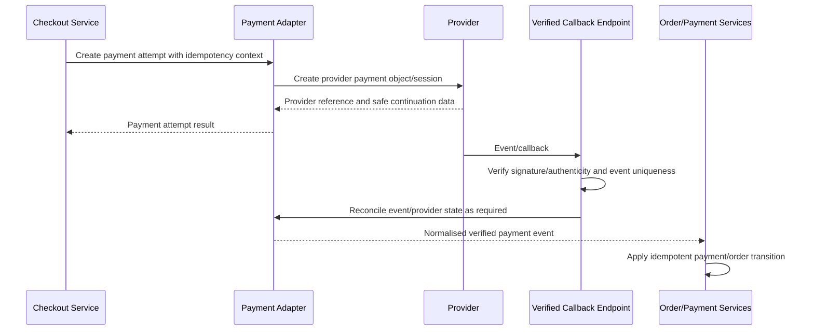

# Odhvica — Integration Specification

| Field | Value |
|---|---|
| Document ID | 20 |
| Status | Integration architecture approved; provider capabilities and payloads require current official-documentation verification before implementation |
| Version | 0.1 |
| Product | Odhvica reusable handmade-fashion e-commerce template |
| Owner | Technical lead / integration owner |
| Last updated | 2026-08-12 |

## 1. Purpose

This document defines how Odhvica connects to payment, shipping, messaging, media, analytics and marketing providers. It establishes an adapter-based integration pattern that keeps provider-specific credentials, payloads and failure behaviour outside the core commerce domain.

Each independently deployed client store connects only to its own provider accounts and credentials. The master template contains connection interfaces, configuration structure, verification rules, error/retry patterns and test strategy; it never includes another client’s private key, account ID, webhook secret, delivery data or marketing audience.

## 2. Integration Principles

| Principle | Requirement |
|---|---|
| Adapter boundary | Core services depend on provider-neutral interfaces; provider SDK/API details remain inside adapters. |
| Client ownership | Payment, domain, courier, messaging, analytics and advertising accounts are client-owned or explicitly authorised for that client. |
| Server-side secrets | Private keys, access tokens and webhook secrets never reach browser code or source control. |
| Verified external events | Payment/shipping/provider callbacks are verified, deduplicated and processed idempotently. |
| Graceful degradation | A provider outage must not corrupt orders; customer/admin receive a safe retry/alternative/support path. |
| Observability | Integration health, event result, retry state and reconciliation exceptions are visible to authorised operations staff. |
| Least data | Send only data required for the provider task; respect privacy and consent constraints. |
| Replaceability | Provider-specific implementation does not leak into product/cart/order domain rules. |

## 3. Integration Catalogue

| Integration domain | Planned provider/direction | Primary purpose | Client-owned configuration required |
|---|---|---|---|
| India payments | Razorpay | Eligible India checkout/payment/refund workflow | Account credentials, webhook secret, production/test settings and settlement configuration. |
| International payments | Stripe | Eligible foreign-market checkout/payment/refund workflow | Account credentials, webhook secret, production/test settings and supported-market configuration. |
| International payments | PayPal | Eligible foreign-market checkout/payment/refund workflow | Account credentials, webhook/callback settings, production/test configuration. |
| Shipping | Courier-provider adapter(s) | Rates/labels/tracking/pickup where enabled | Client courier account, serviceable regions, credentials and policy. |
| Transactional email | Provider selected per client | Order/payment/shipping/support messages | Sender domain, templates, API key and delivery configuration. |
| WhatsApp/SMS | Provider selected per client | Consent-aware transactional and marketing messages where enabled | Approved sender/template/account credentials and consent rules. |
| Media storage | S3-compatible/object-storage or controlled VPS media service | Product/content uploads and optimised delivery | Storage access credentials, bucket/namespace, retention and backup policy. |
| Analytics | Client-selected analytics/search/advertising tools | Measurement and marketing attribution | Client property IDs, consent configuration and role access. |
| Error/monitoring | Client-approved error/log/uptime service | Operational visibility | Project/account keys and data-sharing configuration. |

## 4. Provider-Neutral Interfaces

The application should define internal interfaces before selecting exact SDK calls. These interfaces become stable boundaries for testing and provider replacement.

| Adapter | Core operations |
|---|---|
| Payment adapter | Determine eligibility, create payment attempt/session, retrieve/verify payment state, verify event, refund, reconcile reference. |
| Shipping adapter | Validate serviceability, quote/resolve method where enabled, create shipment/label, track shipment, verify/update carrier event. |
| Messaging adapter | Render/send transactional message, check delivery state, receive delivery event where supported, retry safely. |
| Media adapter | Create upload intent/reference, validate/finalise asset, generate safe delivery URL/metadata, archive/delete under policy. |
| Analytics adapter | Emit approved event, protect consent rules, deduplicate purchase events and report delivery failure without blocking commerce. |
| Monitoring adapter | Capture safe error/metric/health event with client/environment context and no unnecessary personal data. |

## 5. Payment Integration Requirements

### 5.1 Payment Routing

Payment routing must be deterministic and based on eligible checkout context. Customer-visible payment options are filtered by configured country/region, currency, store configuration, cart/order conditions and provider capability.

| Route | Intended use | Preconditions |
|---|---|---|
| Razorpay | India payment route | Client account active, eligible customer/checkout market and supported configuration validated. |
| Stripe | International payment route | Client account active, market/currency/payment method supported and checkout configuration validated. |
| PayPal | International payment route | Client account active, market/currency/payment method supported and checkout configuration validated. |
| Alternative/manual payment | Future/client-specific only | Explicit scope, fraud/reconciliation/fulfilment policy and compliance review. |

The frontend must never decide payment eligibility by itself. The checkout service requests an eligible-method list from server-side configuration and current checkout context.

### 5.2 Payment Lifecycle

### 5.3 Payment Data Rules

| Rule | Requirement |
|---|---|
| Card/payment details | Odhvica must not store raw card or sensitive payment credentials. Use the provider’s approved secure payment workflow. |
| Provider references | Store only required provider IDs, status references and safe audit metadata. |
| Idempotency | Payment creation, callbacks and refunds use unique internal/provider idempotency controls. |
| Amount | Provider request amount comes from validated server-side checkout snapshot. |
| Currency | Provider request currency is validated against route eligibility and stored order/payment snapshot. |
| Webhooks/callbacks | Verify signature/authentication using current provider documentation; never trust browser redirect alone. |
| Refunds | Initiated only by authorised staff/service state; provider result updates internal payment/refund timeline. |
| Reconciliation | Pending/mismatched/duplicate provider events create restricted operations exceptions. |

### 5.4 Provider Validation Checklist

Before enabling a payment adapter in any client production store, validate through the provider’s current official documentation and test environment:

| Validation item | Requirement |
|---|---|
| Merchant eligibility | Client legal/entity/account eligibility for intended countries and products. |
| Supported markets/currencies | Confirm intended customer regions and currencies. |
| Payment methods | Confirm actual methods available to client account/configuration. |
| Payment session/intent flow | Confirm client/server responsibilities and secure hand-off. |
| Webhook/callback support | Confirm endpoint, event types, signing/verification and retry behaviour. |
| Refund/dispute behaviour | Confirm API/status flow, limits and operational process. |
| Test mode | Confirm safe testing with no live settlement. |
| Data/security | Confirm required secret handling and restricted permissions. |
| Failure modes | Test decline, cancellation, duplicate callback, delayed event and network interruption. |

## 6. Shipping and Courier Integration Requirements

Shipping is configurable by client. The core template supports manual shipping methods/tracking first. Courier automation is an optional module enabled only when the provider, client account and operational process are validated.

| Capability | Core / optional | Requirement |
|---|---|---|
| Shipping zones/methods/rates | Core | Store configuration with eligibility rules and customer-visible delivery estimate. |
| Free shipping threshold/rule | Core | Pricing/shipping service evaluates condition server-side. |
| Manual tracking entry | Core | Authorised staff records carrier/service/tracking and customer notification state. |
| Serviceability check | Optional | Provider/client configuration determines whether destination is served. |
| Live rate quote | Optional | Must have timeout/fallback behaviour; checkout cannot show misleading rate. |
| Label creation | Optional | Provider adapter stores safe reference and failure/retry state. |
| Pickup scheduling | Optional | Explicit operational ownership and provider workflow. |
| Tracking sync/webhook | Optional | Verified event/polling design, idempotent shipment timeline update. |
| Return label/pickup | Future/optional | Requires return-policy and provider support validation. |

A shipping provider failure must not silently mark an order shipped. The admin must see a clear manual fallback path, and the customer must not receive a dispatch confirmation until an authorised fulfilment action occurs.

## 7. Messaging Integration Requirements

Transactional messages are an operational function. Marketing messages are a consent-governed function. The system must keep these categories and their data handling distinct.

| Message type | Trigger examples | Rules |
|---|---|---|
| Transactional email | Order confirmation, payment issue, production update, shipment, refund/return update | Triggered from durable order/event state; retryable; no marketing consent requirement where permitted. |
| Transactional WhatsApp/SMS | Time-sensitive order/shipment/support updates | Use only with approved sender/template/provider and applicable consent/policy. |
| Marketing email | Newsletter, campaign, abandoned cart, product update | Requires valid consent/preferences and approved marketing integration. |
| Marketing WhatsApp/SMS | Offers and campaigns | Higher consent/template/regulatory sensitivity; enable only after explicit configuration and review. |
| Internal admin notice | Failed payment, low stock, job failure, fulfilment exception | Role-appropriate recipient; avoid sensitive customer data in unnecessary channels. |

Messages must contain appropriate store/client brand context, accurate order state, safe links, no leaked secrets, and delivery status where provider support allows. Content templates are managed through approved content/notification workflows.

## 8. Media Storage and Upload Requirements

| Requirement | Rule |
|---|---|
| Upload authorisation | Only authorised admin/customer flows can initiate upload; uploads are scoped to intended product/content/order relationship. |
| File validation | Validate type, size, dimensions/duration and permitted purpose before final association. |
| Storage isolation | Use client-specific namespace/bucket/path; prevent guessed public/private object access. |
| Customer uploads | Reference-image/custom-order files follow stricter privacy/access/retention controls. |
| Media derivatives | Generate/serve optimised responsive image variants without losing original asset governance. |
| Virus/abuse review | Define scanning/quarantine policy before accepting untrusted uploads at scale. |
| Deletion | Respect reference integrity, legal/operational retention and backup lifecycle. |
| Backup | Media backup/recovery policy is tested with the client deployment. |

## 9. Analytics and Marketing Integrations

Analytics events must follow the provider-neutral schema in `14_seo_analytics.md`. Client accounts/identifiers are configured in the client deployment and loaded only subject to consent/policy rules.

| Integration control | Requirement |
|---|---|
| Consent gate | Activate/emit only as allowed by client policy and market requirements. |
| Event filtering | Never send payment details, address, custom measurement contents, private notes, uploaded file data or other sensitive content as normal event properties. |
| Purchase deduplication | Browser/server/provider events use a documented deduplication strategy. |
| Performance budget | Third-party scripts are assessed for loading/performance impact before enablement. |
| Failure isolation | Analytics outage cannot block browse, cart, checkout, payment or order creation. |
| Client separation | No cross-client pixel IDs, audiences, feed data or reports. |

## 10. Integration Configuration and Secret Management

| Configuration class | Storage rule |
|---|---|
| Public identifier | May be delivered to browser only if provider design explicitly requires it and it has no secret privilege. |
| Private secret/token | Server-only environment/secret store; never database plaintext, client bundle, logs or documentation. |
| Webhook secret | Server-only secret; rotate/revoke according to provider/client policy. |
| Account metadata | Store non-sensitive provider/account/status reference only as needed for operations. |
| Environment | Separate local, test/staging and production values; production keys never used in test. |
| Rotation | Document owner, last-rotated reference, impact and rollback/reconnect procedure. |
| Access | Grant least privilege; revoke when staff/developer access ends. |

## 11. Failure, Retry and Reconciliation

| Failure type | System behaviour |
|---|---|
| Provider timeout | Return safe customer/admin error, preserve operation context and retry only when idempotent. |
| Invalid credentials/configuration | Mark integration unhealthy, alert authorised owner and stop misleading customer path. |
| Duplicate event | Record/deduplicate; no repeated order/refund/notification mutation. |
| Delayed callback | Maintain pending state; reconcile through safe scheduled/admin procedure. |
| Mismatched amount/currency/reference | Stop automatic fulfilment, record exception and require controlled review. |
| Rate-limit response | Backoff/retry within provider policy; surface operational impact. |
| Courier event inconsistency | Record raw/normalised event, prevent impossible state transition and route for review. |
| Messaging delivery failure | Retry using approved policy; record final failure for support/operations. |

## 12. Client Integration Onboarding Checklist

| Step | Required evidence |
|---:|---|
| 1 | Client owns/authorises account and identifies operational contact. |
| 2 | Test and production credentials are stored safely in client-specific environment. |
| 3 | Intended regions/currencies/products are confirmed against provider eligibility. |
| 4 | Webhook/callback endpoint is configured and verification tested. |
| 5 | Success, failure, cancellation, duplicate and delayed-event tests pass. |
| 6 | Refund/tracking/notification and manual fallback procedures are documented. |
| 7 | Consent/privacy/policy content is approved for relevant integrations. |
| 8 | Monitoring, alert recipient and credential-rotation owner are recorded. |
| 9 | Production go-live is approved after test transaction and reconciliation check. |

## 13. Integration Acceptance Criteria

An integration is acceptable only when it has a documented owner, eligible scope, server-side secret handling, verified request/event path, idempotent state mapping, failure/retry/reconciliation procedure, permission boundary, test evidence, monitoring and client-specific configuration. An enabled UI button or API key alone is not sufficient evidence of a reliable integration.

## Related Documents

`05_commerce_rules.md` defines commerce policy. `16_architecture_design.md`, `17_system_design.md` and `19_api_contracts.md` define system/adapters/contracts. `18_db_schema.md` defines integration/event records. `21_security_blueprint.md` defines control requirements. `27_devops_deployment.md` will define client environment and release procedure.
