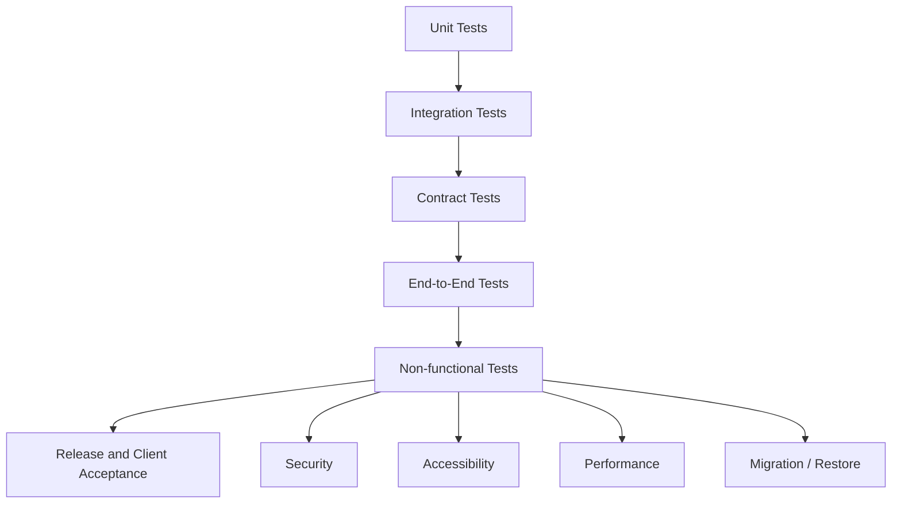

# Odhvica — Testing and Quality Strategy

| Field | Value |
|---|---|
| Document ID | 26 |
| Status | Approved quality baseline; tool selections and exact thresholds finalised during implementation |
| Version | 0.1 |
| Applies to | Odhvica master template, reference store and every independently deployed client store |
| Owner | Technical lead / QA owner |
| Last updated | 2026-08-12 |

## 1. Purpose

This document defines how Odhvica quality is verified before code is released, a client store is launched, or a master-template change is promoted. It covers functional, integration, contract, end-to-end, security, accessibility, performance, data migration, infrastructure and client acceptance testing.

The quality strategy is risk-based. A cosmetic storefront change and a payment/refund/inventory change do not require the same testing depth. However, every client storefront redesign still requires functional, responsive, accessibility and performance checks because visual work can break the purchase journey.

## 2. Quality Objectives

| Objective | Quality outcome |
|---|---|
| Commerce correctness | Price, promotion, stock, checkout, payment, order, fulfilment and refund states remain accurate and non-duplicated. |
| Customer confidence | Customers receive clear, accessible, responsive and truthful product/order experience. |
| Admin operability | Store owners can manage routine catalogue/orders/content/settings without developer intervention. |
| Security | Unauthorised users cannot access/alter protected data, secrets, funds or high-risk settings. |
| Resilience | Provider, network, queue, cache or deployment failures produce safe recovery paths. |
| Performance | Critical storefront/admin paths meet approved measured budgets on representative conditions. |
| Reuse safety | Master changes do not silently break reference/client stores; client customs stay isolated. |
| Release confidence | Every production release has traceable test evidence, approvals, deployment and rollback plan. |

## 3. Test Strategy Layers

| Test layer | Purpose | Examples |
|---|---|---|
| Unit | Verify deterministic domain rules/components in isolation | Money/rounding, discount eligibility, state transitions, validation, price display. |
| Integration | Verify services with database/repository/job/provider-adapter test double | Create product, reserve stock, build checkout, apply payment event, create fulfilment. |
| Contract | Verify API/server action request/response/auth/error compatibility | Cart mutation, admin product save, provider callback, customer order retrieval. |
| End-to-end | Verify complete customer/admin workflows in realistic browser environment | Browse, select variant, cart, checkout, account, product publish, order fulfilment. |
| Security | Verify auth, authorisation, tampering, secret, upload and webhook controls | Customer order isolation, refund permission, price manipulation, event replay. |
| Accessibility | Verify keyboard, labels, focus, errors, contrast/content rules and assistive behaviour | Product selection, cart, checkout, admin tables/forms. |
| Performance | Verify page/media/bundle/server/database/load behaviour | Home, collection, product, cart, checkout and admin order list. |
| Migration/restore | Verify schema/data changes and recoverability | Upgrade migration, backup restoration and data integrity checks. |
| User acceptance | Confirm client/store owner can run contracted workflows | Catalogue, promotions, orders, shipping, content and launch sign-off. |

## 4. Environments and Test Data

| Environment | Purpose | Data rules |
|---|---|---|
| Local development | Fast developer feedback and unit/integration work | Synthetic fixtures only; never production client secrets/data. |
| Shared test/staging | End-to-end, integration/provider sandbox and release validation | Sanitised/synthetic commerce data and test provider accounts. |
| Production | Live client store operations | Test only controlled non-destructive post-release smoke paths; protect customer data. |
| Provider sandbox | Payment/courier/message provider flow validation | Test accounts/keys and documented fake/approved test transactions. |
| Backup/restore environment | Periodic recovery rehearsal | Encrypted/sanitised data according to approved access policy. |

Test data must represent Odhvica’s real complexity: ready-stock, unique item, variant garment, made-to-order product, personalised product, measurement-based product, sale product, discount, domestic/international checkout context, shipment, refund and support request.

## 5. Risk Classification

| Risk tier | Change examples | Required testing level |
|---|---|---|
| Critical | Checkout, payments, refunds, stock reservation, order state, auth/roles, provider callbacks, database migration, secret/infrastructure changes | Unit + integration + contract + end-to-end + security/failure tests + release approval. |
| High | Product publish, pricing/promotions, shipping, customer account, uploads, fulfilment, client data import, analytics purchase event | Unit/integration + relevant end-to-end + security/accessibility/performance review. |
| Medium | Collection/search/filter, content blocks, review/wishlist, reporting, admin list/form patterns | Component/integration + flow/regression + accessibility/responsive review. |
| Lower | Copy change, isolated visual spacing or non-interactive presentation | Review/visual/responsive check; regression if shared component affected. |

A client-specific request is not automatically lower risk. If it changes order/payment/data/access or deployment behaviour, it follows the relevant critical/high path.

## 6. Core Functional Test Matrix

| Domain | Minimum scenarios |
|---|---|
| Product catalogue | Create/edit/draft/publish/archive, images, SEO, attributes, variants, status, import validation, product visibility. |
| Variants | Valid selection, unavailable option, variant price/media change, SKU/stock mapping, cart/order snapshot. |
| Handmade customisation | Required/optional input, validation, field display, measurement units, file rules, cart/order/admin preservation. |
| Inventory | Ready stock, unique item, low stock, reservation/expiration, manual adjustment, cancelled/returned restock, concurrent checkout conflict. |
| Pricing | Base/variant price, sale/reference price, rounding, currency display, discount/freeshipping eligibility and order snapshot. |
| Cart | Guest/customer cart, add/update/remove, quantity limits, customisation, promotion, changed stock/price, expiry/merge rules. |
| Checkout | Address validation, region restriction, shipping option, payment eligibility, final total, error recovery and duplicate submit. |
| Payment | Initiation, success, failure, cancellation, delayed callback, duplicate callback, refund, reconciliation exception. |
| Orders | Creation, timeline, status transition, custom order data, cancellation/request, customer/admin visibility. |
| Fulfilment | Production queue, packing, tracking, shipment update, partial fulfilment if enabled, return/exchange linkage. |
| Customers | Profile, addresses, consent, order ownership, wishlist/review/support/privacy request. |
| Content | Draft/review/schedule/publish, navigation, homepage blocks, policy pages, redirect/SEO change. |
| Admin | Roles, product/order/customer/promotion/settings/reporting actions and audit records. |
| Integrations | Credentials/config health, successful/failed callback, retry/manual fallback and data minimisation. |

## 7. Critical End-to-End Scenarios

| ID | Scenario | Expected result |
|---|---|---|
| E2E-01 | Guest browses collection, filters products, selects valid jacket size and adds to cart | Correct product/variant/price/cart state with accessible feedback. |
| E2E-02 | Customer buys one-of-a-kind item while another session attempts same item | Exactly one valid confirmed purchase; other session receives safe stock update. |
| E2E-03 | Customer orders made-to-order garment with custom measurements | Validated fields persist from product through checkout/order/production/admin view. |
| E2E-04 | Customer orders personalised accessory/gift item | Custom/gift input appears correctly in fulfilment record and confirmation context. |
| E2E-05 | Customer applies valid and invalid discounts/free-shipping condition | Correct total/eligibility and clear recovery without cart corruption. |
| E2E-06 | India payment path completes through verified provider event | One correct payment/order record, stock transition and confirmation notification. |
| E2E-07 | International payment path completes through verified provider event | Eligible provider route, one correct order/payment record and confirmation. |
| E2E-08 | Payment fails/cancels/returns duplicate event | No duplicate order/stock/notification; customer has safe retry state. |
| E2E-09 | Admin creates/publishes product and edits collection/home content | Public route/cache/SEO output changes correctly and no invalid publish occurs. |
| E2E-10 | Admin fulfils paid custom order, adds tracking and customer views order status | Correct timeline, notification, tracking and role-limited behaviour. |
| E2E-11 | Staff requests/authorises refund or return resolution | Permission/state/amount/audit/provider result controls behave correctly. |
| E2E-12 | Customer accesses account/order and attempts another customer’s resource | Own data available; cross-customer data blocked safely. |

## 8. Provider and Webhook Tests

Provider integration must be validated in a non-production provider environment before production enablement and again with controlled post-launch smoke checks.

| Test | Required result |
|---|---|
| Valid callback | Correct signature/auth verification, event record, idempotent internal transition. |
| Invalid signature/source | Request rejected and no internal commerce state changes. |
| Duplicate callback | No duplicate order/refund/stock/notification. |
| Delayed callback | Pending state/reconciliation path works without misleading customer confirmation. |
| Provider timeout | Safe retry/error/manual operations path; request thread does not hang indefinitely. |
| Refund event | Internal payment/refund/order timeline reconciles to verified provider result. |
| Courier event | Verified/validated shipment timeline update; impossible state transition blocked. |
| Messaging failure | Retry/dead status visible; no lost commerce record. |

## 9. Security Test Requirements

| Area | Test examples |
|---|---|
| Authentication | Registration/reset/login/session expiry/revocation/rate-limit/enumeration-safe responses. |
| Authorisation | Customer ownership of cart/order/address; staff role restrictions; owner-only sensitive actions. |
| Input | Invalid/malicious product/content/search/custom input; output sanitisation and schema enforcement. |
| Checkout tampering | Altered client price, discount, currency, stock, shipping or payment status rejected/recalculated. |
| Webhook | Invalid/replayed/out-of-order events do not alter state incorrectly. |
| Uploads | Unauthorised, disallowed type, oversized, malformed or private-file access attempts blocked. |
| Secrets/logging | No credential/PII leakage in build, response, client bundle or logs. |
| Rate/abuse | Login, reset, search, checkout, contact/upload and public callback controls tested. |
| Infrastructure | TLS, exposed ports, reverse proxy, environment separation, database/cache isolation and backup access reviewed. |

## 10. Accessibility Test Requirements

Accessibility testing must combine automated checks with manual critical-flow tests. Test product discovery, navigation, search/filters, gallery, variant/swatches, custom forms, cart, checkout, account, admin tables/forms, dialogs/drawers and dynamic status messages.

| Test | Required outcome |
|---|---|
| Keyboard-only | All critical actions can be reached/completed; focus remains visible/logical. |
| Form errors | Labels, required status, instructions and errors are clear and recoverable. |
| Screen-reader spot checks | Landmarks, headings, product state, selected variant, cart/checkout status and dialogs communicate meaningfully. |
| Contrast/responsive | Theme/component states remain readable at supported viewport/zoom conditions. |
| Content review | Product media alt text, campaign text, links, tables, policy pages and image-only content are accessible. |
| Reduced motion | Motion is nonessential or respects preference. |

## 11. Performance Test Requirements

| Test | Required coverage |
|---|---|
| Critical routes | Home, collection, product, cart, checkout, account and admin order/product views. |
| Media | Representative textile/embroidery imagery, product galleries, campaign hero and mobile responsive derivatives. |
| JavaScript/CSS | Bundle/regression analysis for shared components, client theme and third-party additions. |
| Database | Catalogue/order volumes and high-risk queries; slow-query/index review. |
| Concurrency | Unique inventory/checkout/payment event paths under simultaneous attempts. |
| Provider latency | Checkout remains safe under slow/failing payment/shipping/message provider. |
| VPS capacity | CPU/memory/disk/network/database/queue behaviour under representative client traffic/workload. |
| Field monitoring | Post-release route/error/server/job metrics monitored for regression. |

## 12. Migration and Backup/Restore Tests

| Test | Required result |
|---|---|
| Forward migration | Schema/data change applies to realistic non-production data without integrity loss. |
| Compatibility | Application versions/migrations are deployed in correct order; no broken route during rollout. |
| Rollback/forward fix | A documented recovery approach exists; migration reversal is not assumed safe without proof. |
| Backup restore | Client-scoped backup restores to controlled environment and key data integrity checks pass. |
| Data sanitisation | Production-like test data is sanitised/authorised; no uncontrolled customer data copying. |
| Reporting/order validation | Restored data maintains expected order/payment/inventory/history relationships. |

## 13. Release Quality Gates

| Gate | Required evidence |
|---|---|
| Scope | Approved requirement, acceptance criteria and master/client classification. |
| Code | Lint/type/build/static checks pass; code review complete. |
| Functional | Relevant unit/integration/contract/e2e tests pass. |
| Security | Required auth/permission/input/provider/upload/secret checks pass. |
| UX | Responsive, accessibility and content/design-system checks pass. |
| Performance | Critical affected route meets budget/baseline or approved exception exists. |
| Data | Migration/seed/backup implications reviewed and rehearsed where required. |
| Operations | Environment/secrets, monitoring, rollback, release note and support impact ready. |
| Client | For client release, configuration/catalogue/policy/payment/shipping/domain/analytics launch checklist approved. |

## 14. Defect Management

| Severity | Meaning | Release rule |
|---|---|---|
| Blocker | Prevents purchase, causes data/financial/security loss, exposes private data or blocks launch | Must be fixed/mitigated before release. |
| Critical | Major commerce/security/operational path broken with no acceptable workaround | Blocks relevant release unless formally risk-accepted by owner. |
| High | Significant feature/UX regression with limited workaround | Fix before launch or document approved deferral. |
| Medium | Material but manageable defect | Plan/fix according to priority and client impact. |
| Low | Cosmetic/minor edge condition with negligible impact | Track and resolve in planned maintenance. |

Defect records must include environment, steps, expected/actual result, evidence, affected user/data risk, release/version, owner and test regression requirement.

## 15. Client Acceptance Testing

Before a client store launch, the client owner must be able to test the contracted workflows with safe test data or controlled production-ready setup. Acceptance includes store identity/content, product catalogue, pricing/stock, shipping, payment, policies, customer messages, admin access/training, responsive storefront, analytics/consent and domain/TLS readiness.

The client must provide launch sign-off for business content and policies. Technical deployment approval does not substitute for client approval of products, prices, legal content, shipping promises or payment/business account configuration.

## 16. Quality Acceptance Criteria

A release is quality-ready when the risk-appropriate test layers pass, critical commerce and security scenarios are proven, accessibility/performance requirements are met, data/deployment recovery is known, defects are triaged, documentation is current, and client acceptance is recorded for client-store launches.

## Related Documents

`25_code_quality.md` defines engineering standards. `16_architecture_design.md` through `24_reference_implementation.md` define what is tested. `21_security_blueprint.md` and `22_performance_plan.md` define non-functional controls. `27_devops_deployment.md` and `29_implementation_plan.md` define release execution.
