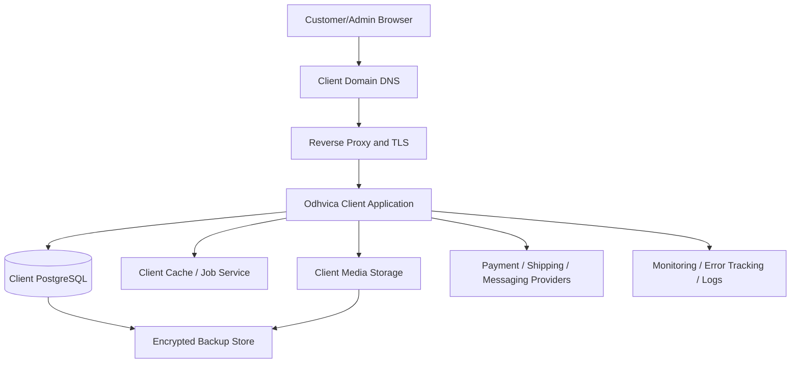

# Odhvica — DevOps and Deployment Runbook

| Field | Value |
|---|---|
| Document ID | 27 |
| Status | Approved operational direction; exact VPS sizing/tooling verified before first production deployment |
| Version | 0.1 |
| Applies to | Odhvica reference store and each independent client-store deployment |
| Hosting direction | Hostinger VPS-compatible, client-isolated production deployment |
| Owner | Technical lead / operations owner |
| Last updated | 2026-08-12 |

## 1. Purpose

This document defines how Odhvica is deployed, configured, monitored, backed up, updated and recovered on a VPS-compatible production environment. The operational model supports a protected master template and separate client-store deployments. Each client store has its own domain, environment, database, media namespace, secrets, release history, backups and monitoring context.

The objective is repeatable, secure and recoverable delivery—not a manual one-time server setup. Exact implementation tooling may evolve, but every deployment must preserve the controls and stages in this runbook.

## 2. Operating Principles

| Principle | Requirement |
|---|---|
| Client isolation | Deploy each client separately; never mix production data/secrets between client stores. |
| Repeatability | Build and deploy from version-controlled application/infrastructure definitions, not undocumented server changes. |
| Least privilege | Restrict VPS, database, secret, provider and deployment access to what each role needs. |
| Immutable release intent | Release a tested application artifact/version; do not patch production files manually except under documented emergency procedure. |
| Safe migration | Back up, review and rehearse data migrations; use forward-fix/rollback strategy appropriate to change risk. |
| Observability | Health, errors, jobs, provider callbacks, database growth, resource use and backups are visible before customer reports them. |
| Recoverability | Document and test restore/rollback paths; a backup that has never been restored is not sufficient evidence. |
| Security by operation | Keep OS/packages/secrets/TLS/firewall/access updated and reviewed as routine operations. |

## 3. Environment Model

| Environment | Purpose | Data/secrets rule |
|---|---|---|
| Local development | Developer implementation and fast feedback | Synthetic fixtures/test credentials only. |
| Test/staging | Integration, end-to-end, provider sandbox and release rehearsal | Sanitised/synthetic data; separate provider/test secrets. |
| Production | Live customer/admin commerce | Client-specific production data and secrets only. |
| Backup/restore target | Recovery rehearsal and incident restoration | Encrypted, access-controlled and time-limited as required. |

Production keys must never be used in local or test environments. Production customer/order data must not be copied to development without documented sanitisation and authorisation.

## 4. Client Deployment Topology

| Component | Production requirement |
|---|---|
| Domain and DNS | Client domain with documented ownership, DNS entries, redirect policy and renewal responsibility. |
| Reverse proxy | HTTPS termination, certificate renewal, secure headers, request/body limits and routing. |
| Application | Versioned Odhvica build/process with health checks, controlled environment and restart strategy. |
| Database | Client-isolated PostgreSQL with restricted network access, backup/recovery and migration management. |
| Cache/jobs | Private service access, authentication where appropriate, persistence/queue health and bounded memory policy. |
| Media | Client-isolated object/media storage with public/private access rules and backup lifecycle. |
| Monitoring | Client/environment-specific error, health, resource, job and backup alerts. |
| Providers | Client-specific account/secrets/webhook endpoints and validated production/test modes. |

## 5. VPS Baseline Hardening

Exact Hostinger VPS plan and OS setup will be selected before deployment. The following controls are mandatory regardless of provider plan.

| Area | Baseline control |
|---|---|
| Operating system | Supported stable OS release, minimal installed packages, routine security update policy. |
| Access | Named user accounts, key-based access, strong privilege separation and access review. |
| Firewall | Expose only required web/proxy services; keep database/cache/admin services private. |
| Remote access | Restrict SSH/management access, disable obsolete/insecure access patterns and log privileged activity. |
| TLS | Automated certificate renewal/expiry monitoring; force HTTPS and safe redirect policy. |
| Reverse proxy | Request limits, safe proxy trust configuration, compression/caching policy and security headers. |
| Service accounts | Application/database/worker processes run with non-root least privilege where practical. |
| Secrets | Production secrets injected securely; not committed, echoed in process output or copied to logs. |
| Disk | Separate/monitor application, database, media, logs, temporary files and backup capacity. |
| Time | System time synchronisation and UTC operational timestamps. |

## 6. Deployment Artifact and Build Policy

The application should be built from a tagged/versioned source revision. The deployment artifact includes the application build and approved runtime/infrastructure configuration, but never production secrets or customer data.

| Step | Requirement |
|---:|---|
| 1 | Select approved master/client release version and record change summary. |
| 2 | Run required quality checks: type/build, tests, security/dependency checks and route-specific performance/accessibility checks. |
| 3 | Build reproducible production artifact/container using locked dependencies. |
| 4 | Validate artifact in staging with the intended schema/configuration/provider sandbox where applicable. |
| 5 | Back up production database/media/configuration metadata and verify rollback readiness. |
| 6 | Deploy artifact with controlled environment settings and health checks. |
| 7 | Run migration only through approved migration procedure. |
| 8 | Run post-deploy smoke tests and monitor errors/resources/providers. |
| 9 | Record deployed version, migration state, operator, time and result. |

## 7. Release Procedure

| Phase | Required action |
|---|---|
| Plan | Identify scope, risk tier, client/master classification, dependencies, migration/integration impact, release window and rollback owner. |
| Prepare | Complete code review/quality gates, release notes, environment/configuration diff and backup plan. |
| Stage | Deploy to test/staging; run functional, provider sandbox, performance/security/accessibility tests relevant to change. |
| Approve | Technical owner approves; client owner approval is required for client-visible/content/policy/payment/business changes. |
| Deploy | Deploy versioned artifact, apply approved migration, refresh/reload process and check health endpoints. |
| Smoke test | Validate public home/product/cart, admin authentication, product/order data, payment route safe test/health, notifications/jobs and monitoring. |
| Observe | Monitor logs/errors/resources/queues/provider events for defined observation period. |
| Close | Document final release state, known issue, rollback window and client communication. |

## 8. Database Migration Procedure

Database migration is a production operation, not a side effect of application start.

| Migration step | Requirement |
|---|---|
| Design review | Document schema/data/business/API/security impact and backward compatibility. |
| Test rehearsal | Run on representative non-production data; measure duration/locks/failure path. |
| Backup | Take verified client-scoped backup before high-risk data/schema change. |
| Compatibility | Ensure deployed application/migration order supports a safe transition. |
| Execute | Run only approved version-controlled migration with operator/audit record. |
| Validate | Check schema state, key order/payment/product data, application health and query errors. |
| Recover | Use documented rollback or forward-fix; do not make unreviewed manual production edits. |
| Record | Add migration/release result and any data remediation note. |

## 9. Configuration and Secret Management

| Configuration class | Rule |
|---|---|
| Public configuration | Non-sensitive brand/storefront values may be versioned/configured with approval. |
| Runtime configuration | Region, shipping, feature flags and provider settings use documented client-specific environment/configuration. |
| Secret | Database credentials, API keys, webhook secrets, private tokens and SSH material are server-only and never committed. |
| Environment separation | Local/test/staging/production values are distinct. Production secrets are not used in testing. |
| Change control | Secret/config changes have owner, date, affected integration and safe rollback/reconnect procedure. |
| Rotation | Rotate after staff departure, suspected exposure, provider requirement or scheduled policy; test dependent service after rotation. |
| Client handover | Client-owned accounts/keys remain accessible to authorised client owner; access boundary is documented. |

## 10. Backup and Restore Plan

| Asset | Backup requirement | Restore validation |
|---|---|---|
| PostgreSQL database | Scheduled encrypted client-scoped backups with retention policy and protected access. | Periodic restore into controlled environment; verify orders, products, payments and relationships. |
| Media | Back up product/content/private upload assets or ensure provider redundancy with documented recovery approach. | Sample retrieval and full recovery rehearsal according to data importance. |
| Configuration metadata | Versioned safe configuration plus protected secret recovery process. | Recreate deployment in controlled environment without exposing secret values. |
| Infrastructure definitions | Version-controlled proxy/container/deployment/monitoring configuration. | Rebuild/redeploy rehearsal. |
| Logs/audits | Retention/export appropriate to client/security/legal needs. | Verify availability for incident/reconciliation investigation. |

Backup success notifications are not enough. A scheduled restore test must prove that a usable client deployment/data set can be recovered within the agreed operational objective.

## 11. Monitoring and Alerting

| Signal | Alert / operational response |
|---|---|
| Application health | Alert on unavailable/unhealthy process/route; investigate reverse proxy, runtime and dependencies. |
| Error rate | Alert on sustained unexpected server/API error increase; correlate release/request/module. |
| Payment/provider events | Alert on failed verification, pending payment backlog, reconciliation mismatch or refund failure. |
| Queue/jobs | Alert on growing queue, repeated retry, dead jobs or notification failure. |
| Database | Monitor availability, connection saturation, slow queries, disk growth, backup result and replication if used. |
| VPS resources | Monitor CPU, memory, disk, network and process restart behaviour. |
| TLS/domain | Alert before certificate expiry and on unexpected domain/redirect failure. |
| Security | Alert on suspicious auth/rate-limit/access/secret/infrastructure events as configured. |
| Business exceptions | Paid unfulfilled orders, stock conflict, shipment exception, failed transaction messages and import failure. |

Alerts require named owner, severity, notification route and runbook action. Do not send raw sensitive data in broad alert channels.

## 12. Rollback and Recovery

| Situation | Recovery approach |
|---|---|
| Application release defect without migration conflict | Re-deploy prior tested artifact/configuration version and confirm health. |
| Migration-compatible defect | Roll back application or deploy forward fix according to compatibility plan. |
| Destructive/data migration issue | Stop unsafe operations, preserve evidence, restore/forward-fix through approved recovery plan; do not guess. |
| Provider configuration failure | Disable unsafe route, revert configuration/secret, use approved manual fallback and communicate impact. |
| VPS/application outage | Restore process/service/proxy from documented infrastructure; validate data/service before reopen. |
| Data loss/corruption | Invoke backup/restore runbook, reconcile orders/payments created around incident window and communicate per policy. |
| Security incident | Follow security incident response: contain, rotate/revoke, preserve evidence, remediate, restore and report. |

A rollback plan must name the prior version, migration compatibility, client impact, owner and validation checks. It is not acceptable to state only “roll back if needed.”

## 13. Client Store Provisioning Checklist

| Step | Evidence |
|---:|---|
| 1 | Client project/repository created from approved master version. |
| 2 | Client VPS/environment, database, storage and backup target provisioned with isolated access. |
| 3 | Client domain/DNS/TLS configured and tested. |
| 4 | Client brand/storefront/configuration/catalogue imported and validated. |
| 5 | Client payment, shipping, email/messaging, analytics and provider callbacks configured in test then production. |
| 6 | Admin users/roles created; client owner access and support/developer boundary confirmed. |
| 7 | Security, performance, accessibility and functional launch checklist passes. |
| 8 | Backup/restore, monitoring/alerts, release/rollback and incident contacts recorded. |
| 9 | Client owner completes acceptance/sign-off and launch communication is approved. |

## 14. Routine Operations Schedule

| Cadence | Operational activity |
|---|---|
| Continuous | Monitor application, errors, provider events, queue, uptime, resource and security signals. |
| Daily/operational | Review paid-unfulfilled orders, failed notifications, integration exceptions, low-stock and backup result. |
| Weekly | Review dependency/security updates, error trends, performance signals, capacity and unresolved alerts. |
| Monthly | Access review, backup restore check/plan, provider credential/configuration review, cost/resource trend and release review. |
| Per release | Quality gates, staged deployment, backup, smoke test, observation and release record. |
| Per client change | Validate new brand/content/payment/shipping/analytics/configuration and update client records. |

## 15. Deployment Acceptance Criteria

A client deployment is production-ready when its application/database/media/provider configuration is isolated, secure and monitored; domain/TLS works; migrations/backups/rollback are ready; critical customer/admin/payment/shipping paths pass smoke tests; client admin access is correct; and client owner has approved launch/business content.

## Related Documents

`16_architecture_design.md`, `20_integration_spec.md`, `21_security_blueprint.md` and `22_performance_plan.md` define operational constraints. `26_testing_quality.md` defines release tests. `28_legal_compliance.md` defines policy/obligation checklist. `29_implementation_plan.md` sequences delivery phases.
